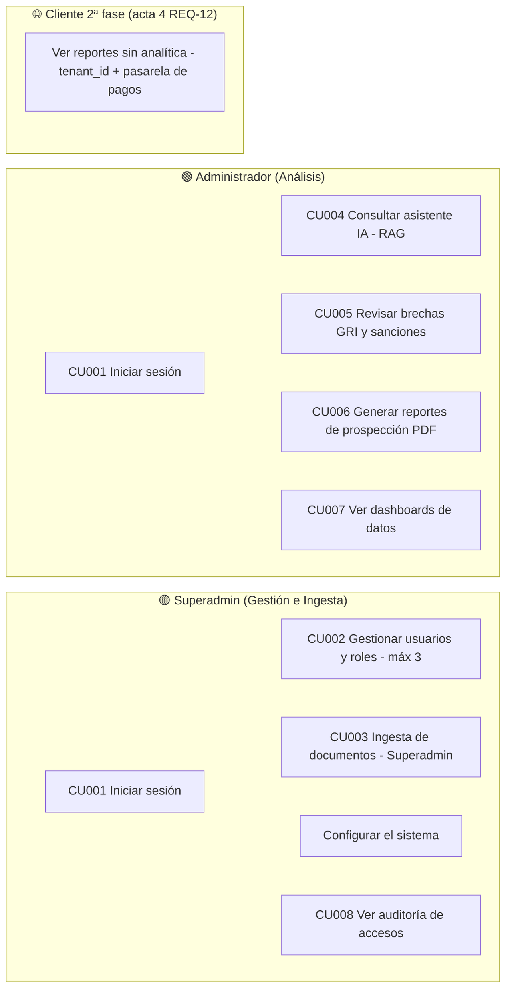

# 17 · Diagrama de Casos de Uso

Diagrama de casos de uso de la plataforma Igualab (Mermaid, renderizable en Obsidian). Complementa [[03 Roles y Control de Accesos]], [[04 Requerimientos Funcionales]] y [[16 Diagramas de Secuencia]].

## 👥 Actores
> ✅ **Acta 4 (REQ-10 — definido):** RBAC de **2 roles / 3 personas** (Oscar = Superadmin + 2 Administradores); el rol "Usuario (Lectura interna)" queda **eliminado**.
- **Superadmin (Gestión e Ingesta)** — 1 persona: Oscar Baldeón
- **Administrador (Análisis / Prospector)** — 2 personas
- ~~**Usuario (Lectura interna)**~~ — ❌ eliminado (acta 4, REQ-10: opción a)
- *(2ª fase, acta 4 REQ-12)* **Cliente** — usuarios externos con `tenant_id` (multi-tenant) + pasarela de pagos

## 🧩 Diagrama
> Representado como `flowchart` porque la versión de Mermaid en Obsidian no soporta `useCaseDiagram`. Numerado **CU001–CU008 según el borrador oficial de Análisis y Diseño** (ver [[22 Análisis y Diseño (Borrador) — Estado y Hallazgos]]).

## 🗂️ Mapeo Actor → Caso de uso → RF

| Actor | Caso de uso (numerado A&D) | RF |
|---|---|---|
| Superadmin | Autenticación y gestión de sesión | RF-001…003 |
| Superadmin | Gestionar usuarios y roles (máx. 3) | RF-005 |
| Superadmin | Ingesta de documentos (memorias/reportes) | RF-006…009 |
| Superadmin | Configurar el sistema | RNF-001 (expiración sesión) |
| Superadmin | Ver auditoría de accesos | RF-020 / RF-021 |
| Administrador | Autenticación y gestión de sesión | RF-001…003 |
| Administrador | Consultar asistente IA / RAG (con citas) | RF-010…012 |
| Administrador | Revisar brechas GRI y sanciones | RF-013…015 |
| Administrador | Generar reportes de prospección PDF | RF-016 / RF-017 |
| Administrador | Ver dashboards de datos | RF-018 / RF-019 |
| ~~Usuario~~ (eliminado acta 4, REQ-10) | — dashboards consultados por Administrador (y Superadmin) | RF-018 / RF-019 |
| Cliente (2ª fase, acta 4 REQ-12) | Ver reportes sin analítica (`tenant_id` + pasarela de pagos) | Por definir en fase 2 |

## ⛔ Fuera del alcance actual
- **Buscar contactos vía LinkedIn** — ❌ eliminado (RF-17; revisión del equipo, Plan aprobado sin LinkedIn). El mockup `b_squeda_linkedin_cu010` queda marcado fuera de alcance ([[20 Prompt Mockup MVP]]).
- **Agendar citas con chatbot inclusivo (onepager)** — ⛔ obsoleto con la fuente archivada; la agenda de citas no está en el numerado oficial.
- **Portal público de lectura** — ⏸️ sustituido por suscripción (2ª fase).

## 🔗 Relacionado
- [[03 Roles y Control de Accesos]] · [[04 Requerimientos Funcionales]] · [[16 Diagramas de Secuencia]] · [[15 Arquitectura de Solución]] · [[22 Análisis y Diseño (Borrador) — Estado y Hallazgos]]
