# 18 · Diagramas de Procesos — Lógica de Negocio

Diagramas de proceso **a nivel de negocio**: actores, actividades, decisiones y resultados. **No incluyen stack tecnológico** (ningún servicio, herramienta o infraestructura); describen *qué hace* la plataforma y *cómo fluye el trabajo*, no *con qué se implementa*. La vista técnica (servicios e infraestructura) vive en [[Diagramas de Procesos]] y [[06 Arquitectura (AWS)]]. El proceso central (9 · prospección comercial E2E) está también modelado en **BPMN 2.0** (estándar de industria): ver [[19 BPMN — Modelado de Procesos (Estándar de Industria)]].

> ⚖️ **Actualizado post-actas (05-09):** alcance vigente = Portal RAG sobre la **base de documentos del cliente**, acotado a **Minería, Energía y Petróleo**; ingesta por el **Superadmin**; **LinkedIn eliminado**; suscripción en 2ª fase. Ver [[21 Actas de Reunión y Acuerdos]]. Los procesos marcados ⛔/⏸️ quedaron fuera del alcance actual (se conservan como referencia).
> ✅ **Acta 4 (08-09, REQ-10/11/12 — definidos):** RBAC de **2 roles / 3 personas** (Oscar = Superadmin + 2 Administradores; 🔵 Lectura eliminado); la fase 1 opera en **desarrollo sin producción** (REQ-11); 2ª fase = **Cliente con `tenant_id` + pasarela de pagos** (REQ-12). El análisis queda **en proceso**: CU + BD/diccionario (REQ-13, ~1–2 semanas). Coherente con el **Análisis y Diseño v1.1** (to-be).

**Convenciones**
- 🔵 Inicio / fin de proceso · `{ }` decisión · 🟡🟢🔵🌐 rol responsable · enlaces entre notas al final de cada sección.
- Todo proceso sensible deja **registro de trazabilidad** (ver proceso 11).

---

## 0. Mapa general de la cadena de valor

Visión de conjunto: cómo el trabajo fluye desde la información pública hasta el negocio de consultoría de Igualab.

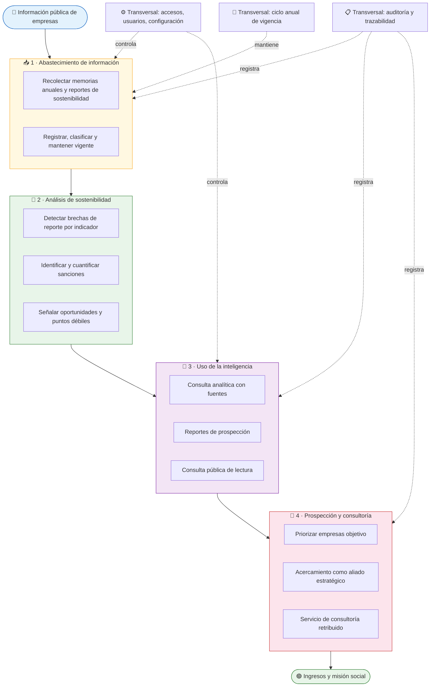

---

## 1. Gestión de accesos y sesión (todos los roles)

**Actor:** personal de Igualab (Gestión 🟡 · Análisis 🟢 — 2 roles, 3 personas, acta 4 REQ-10). Decide el espacio de trabajo según el rol asignado.

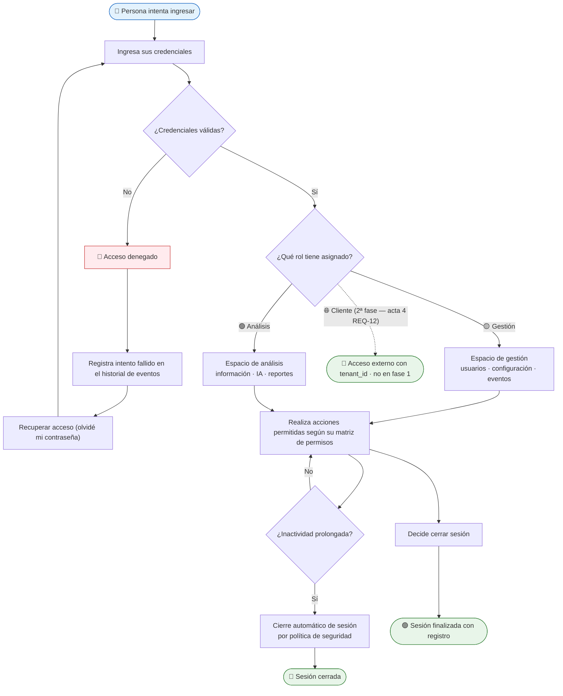

> Reglas de negocio: los roles son **aislados, no jerárquicos** (ver [[03 Roles y Control de Accesos]]); el rol de Gestión **no** usa el asistente de IA; la sesión expira por inactividad (RNF-01). **Acta 4 (REQ-10 ✅):** 3 usuarios — Oscar (Superadmin) + 2 Administradores; rol "🔵 Lectura" eliminado.

---

## 2. Gestión de usuarios y permisos (🟡 rol Gestión)

**Actor:** Superadmin. Único rol que puede administrar personas y permisos.

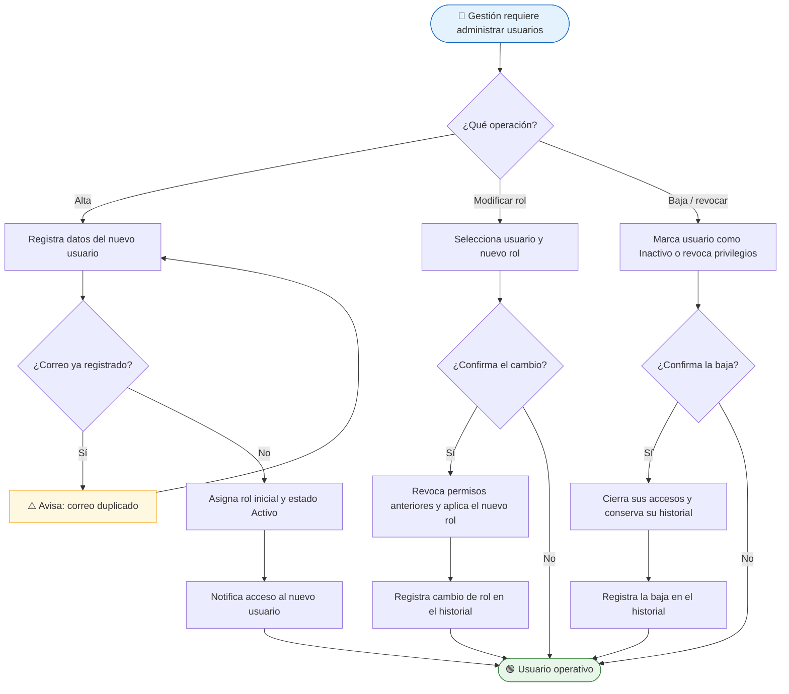

> La **baja es lógica**: el usuario deja de estar activo, pero su rastro histórico se conserva (RNF-04). **Acta 4 (REQ-10 ✅):** los 3 usuarios = **Oscar Baldeón (Superadmin)** + **2 Administradores**; alta manual por el Superadmin (no hay auto-registro ni acceso público en fase 1).

---

## 3. Configuración del sistema (🟡 rol Gestión)

**Actor:** Superadmin. Ajusta políticas generales que afectan a los demás roles.

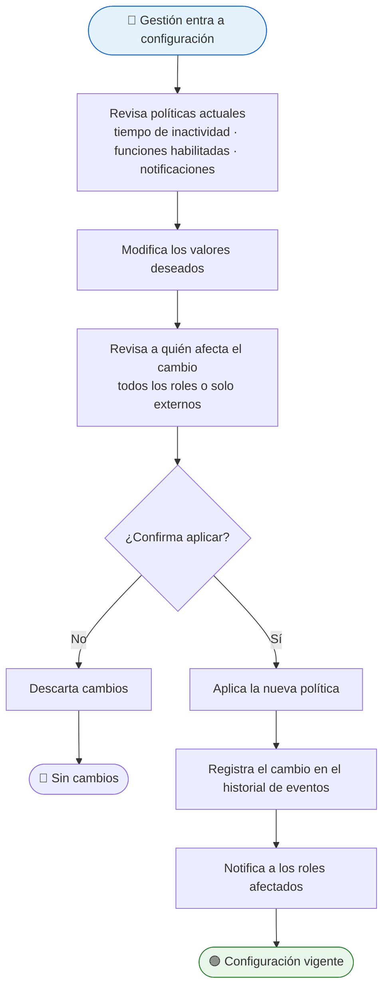

---

## 4. Abastecimiento de información (🟡 rol Gestión e Ingesta)

**Actor:** Superadmin. Alimenta la base de conocimiento con **los documentos del cliente** (memorias anuales y reportes de sostenibilidad que Igualab ya posee — sin API de Bolsa, acta 1), acotado a **Minería, Energía y Petróleo** (acta 3).

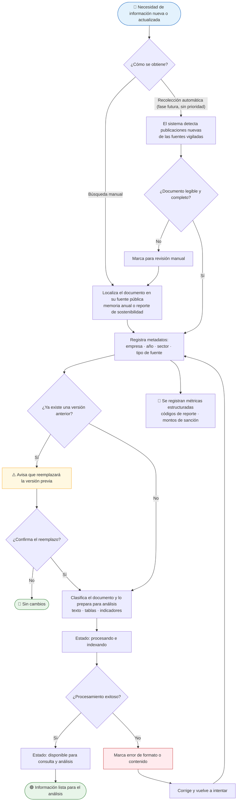

> Fuente de negocio: **los propios reportes del cliente** (sin API ni acceso a Bolsa — acta 1), acotado a **Minería, Energía y Petróleo** (acta 3, REQ-07). Ver [[08 Ingesta de Datos]] y [[04 Requerimientos Funcionales#RF-006 — Carga de documentos (Superadmin)|RF-006…009]].

---

## 5. Análisis de sostenibilidad — detección de brechas (🤖 automático)

**Actor:** el sistema (sin intervención). Detecta indicadores sub-reportados, la base de la oportunidad comercial.

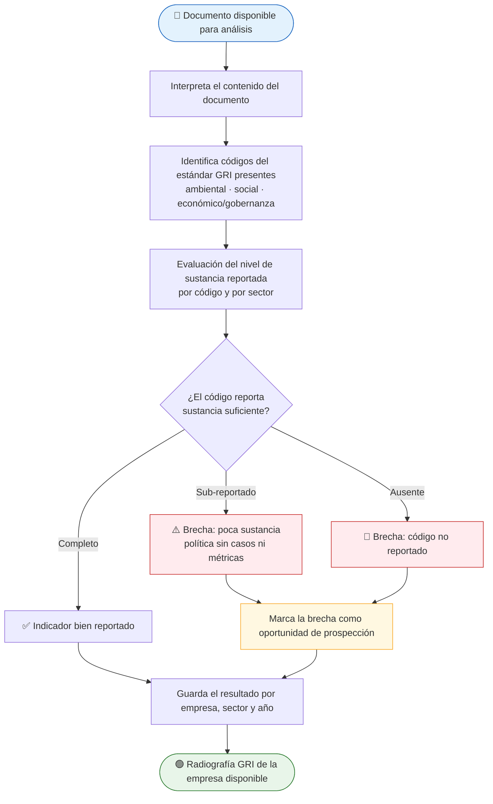

> Regla de negocio: la brecha se define **por código y por sector** (lo "débil" en minería puede ser normal en banca). Alimenta [[14 Requerimientos del Kick-off (RF-11+)|RF-12]].

---

## 6. Análisis de sanciones y reputación (🤖 automático)

**Actor:** el sistema. Cuantifica sanciones económicas desde las memorias anuales.

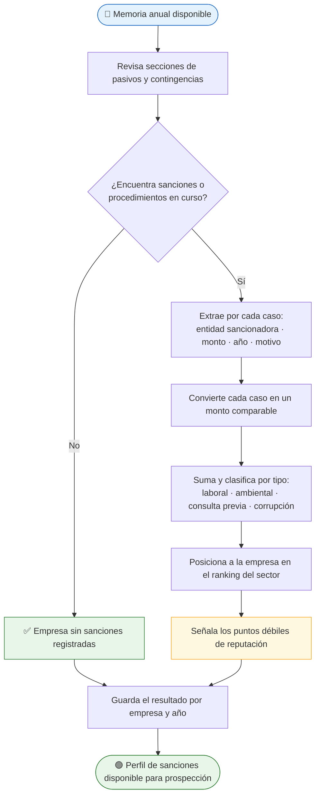

> Los montos deben ser **cuantificables** (S/) y trazables a la fuente y página. Alimenta [[14 Requerimientos del Kick-off (RF-11+)|RF-13]].

---

## 7. Consulta analítica con IA (🟢 rol Análisis)

**Actor:** Administrador/Analista. Pregunta en lenguaje natural; la respuesta **solo usa la base de documentos del cliente** (delimitación — acta 1, REQ-01) y siempre cita su fuente.

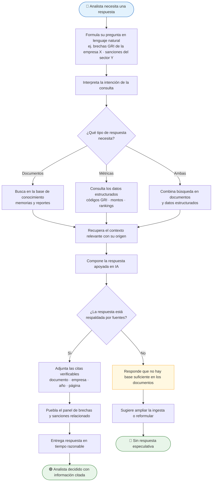

> Reglas de oro del negocio: **ninguna respuesta sin cita** y **delimitación total a la base del cliente** (acta 1). Si la respuesta no está en los documentos → buscar o indicar que no se encontró. Ver [[04 Requerimientos Funcionales#RF-010 — Consulta en lenguaje natural (Administrador)|RF-010…012]] y [[16 Diagramas de Secuencia]].

---

## 8. Reporte de prospección (🟢 rol Análisis)

**Actor:** Administrador/Analista. Compila el dossiere comercial en un documento descargable.

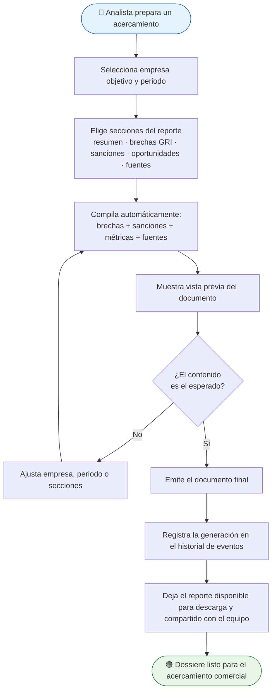

> Un click para el analista: el negocio pide que la preparación no tome más que la selección. Ver [[04 Requerimientos Funcionales#RF-016 — Reporte PDF de prospección (Administrador)|RF-016]].

---

## 9. Prospección comercial de extremo a extremo (🟢🤝 proceso de negocio central)

**Actores:** Analista comercial (🟢) + mercado. Es el proceso que justifica la plataforma: convertir información pública en **ingresos por consultoría**.

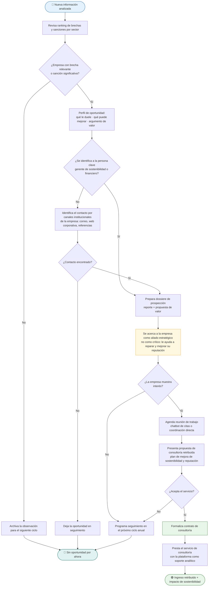

> Este flujo conecta la plataforma con el **pivot a consultoría** del CEO (ver [[13 Visión del CEO y Caso de Uso (Kick-off)]] y [[01 Contexto del Proyecto]]). Cada paso sensible queda registrado (proceso 11).

---

## 10. Consulta pública de información (🌐) — ⏸️ REPLANTEADO

> ⏸️ **Fuera del alcance actual:** el "rol público" se replanteó como **suscripción** (ver la data sin analítica) para la 2ª fase (actas 1–2). Se conserva como referencia.

**Actor:** ciudadano o profesional externo. Solo lectura, unificado, sin prospección; accesible e inmersivo.

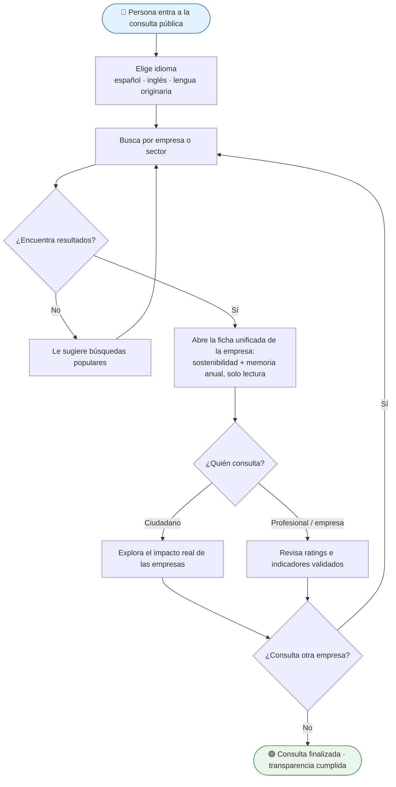

> Referencia histórica: RF-14/RF-15 del kick-off (⏸️ sin prioridad). Ver [[14 Requerimientos del Kick-off (RF-11+)]] y [[17 Diagrama de Casos de Uso]].

---

## 11. Auditoría y trazabilidad (📋 transversal)

**Actor:** el sistema registra; el Superadmin consulta. Protege al negocio y cumple políticas de seguridad.

```mermaid
flowchart TD
    subgraph REGISTRO["📡 Registro (automático)"]
        EV[Ocurre un evento sensible<br/>ingreso · cambio de rol · ingesta · generación o descarga de reporte · configuración · intento fallido]
        EV --> CAP[Registra quién · qué · cuándo · resultado]
        CAP --> CONS[Consolida el registro histórico]
    end

    CONS --> USO

    subgraph USO["🔍 Consulta (🟡 Superadmin)"]
        USO[Filtra por tipo, usuario o rango de fechas]
        FILTRO --> LEE[Revisa la secuencia de eventos]
        LEE --> EXPORTA{"¿Necesita un informe?"}
        EXPORTA -->|"Sí"| DOC[Exporta el informe de auditoría]
        EXPORTA -->|"No"| CIERRA
        DOC --> CIERRA([🟢 Trazabilidad verificada])
    end

    style EV fill:#ffebee,stroke:#c62828
    style CIERRA fill:#e8f5e9,stroke:#2e7d32
```

> Soporta RNF-04 y RF-09 (ver [[04 Requerimientos Funcionales#RF-020 — Registro automático de eventos|RF-020/021]] y [[05 Requerimientos No Funcionales|RNF-04]]).

---

## 12. Ciclo anual de vigencia de la información (🔄 transversal)

**Actor:** el sistema + 🟢 Análisis. Resuelve el reto de la **autonomía**: los documentos son anuales y la base se desfasa.

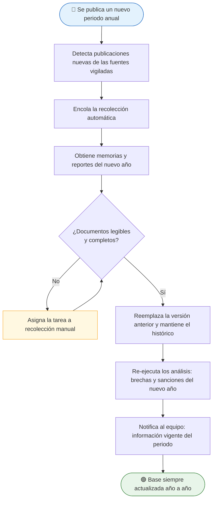

> Ver [[14 Requerimientos del Kick-off (RF-11+)|RF-16]] y [[08 Ingesta de Datos]].

---

## 13. Chatbot inclusivo de citas (🌐) — ⛔ FUERA DEL ALCANCE

> ⛔ **Fuera del alcance actual:** el chatbot de citas venía del onepager (fuente archivada); no está en el numerado oficial ni en las actas. Se conserva como referencia histórica.

**Actor:** público externo con o sin discapacidad. Complemento post-contacto del proceso 9.

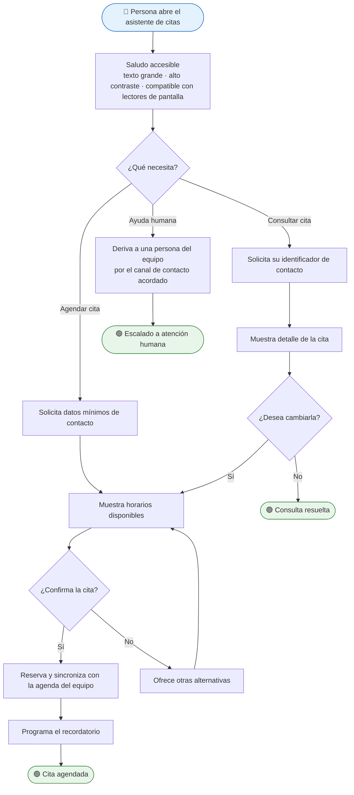

> Referencia histórica: RF-10/RF-19 (⏸️ sin prioridad) y la pregunta rectora del onepager archivado. Ver [[01 Contexto del Proyecto]].

---

## 🗂️ Mapeo Proceso → Actores → Requerimientos

| # | Proceso | Actores | RF / RNF / CU |
|---|---|---|---|
| 0 | Cadena de valor | Todos | Visión general |
| 1 | Accesos y sesión | 🟡🟢🔵🌐 | RF-01 · RNF-01 · CU001 |
| 2 | Usuarios y permisos | 🟡 | RF-02 · CU002 |
| 3 | Configuración | 🟡 | RF-01/RNF-01 · CU003 |
| 4 | Abastecimiento | 🟡 | RF-006…009 · CU003 (A&D) |
| 5 | Brechas GRI | 🤖 | RF-12 · CU006 |
| 6 | Sanciones | 🤖 | RF-13 · CU006 |
| 7 | Consulta IA | 🟢 | RF-05 · CU006 |
| 8 | Reporte prospección | 🟢 | RF-07 · CU007/CU009 |
| 9 | Prospección comercial E2E | 🟢🤝 | RF-006…RF-019 · negocio |
| 10 | Consulta pública | 🌐 | RF-14 · RF-15 · CU012 |
| 11 | Auditoría | 🟡 + 🤖 | RF-09 · RNF-04 · CU004 |
| 12 | Ciclo anual | 🤖 + 🟢 | RF-16 |
| 13 | Chatbot citas | 🌐 | RF-10 · RF-19 · CU013 (F2) |

## 🔗 Relacionado
- [[Diagramas de Procesos]] (vista técnica equivalente) · [[16 Diagramas de Secuencia]] · [[17 Diagrama de Casos de Uso]] · [[03 Roles y Control de Accesos]] · [[04 Requerimientos Funcionales]] · [[14 Requerimientos del Kick-off (RF-11+)]] · [[13 Visión del CEO y Caso de Uso (Kick-off)]]
