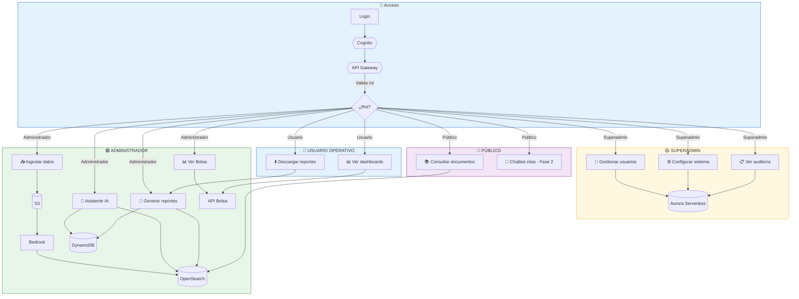
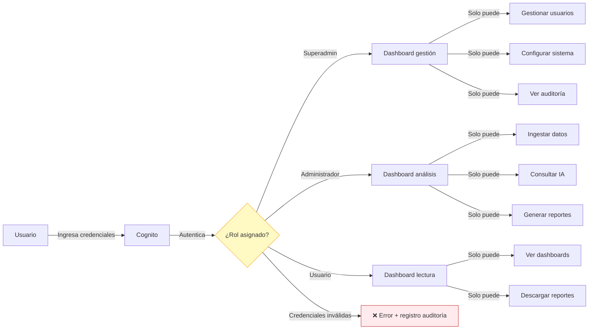
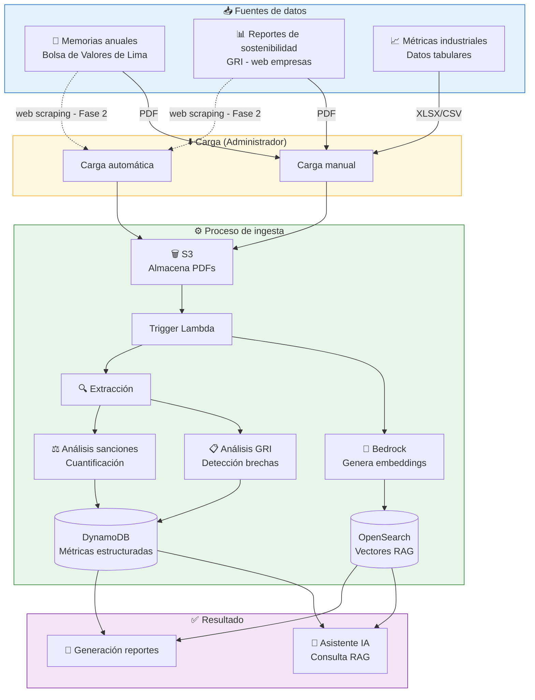
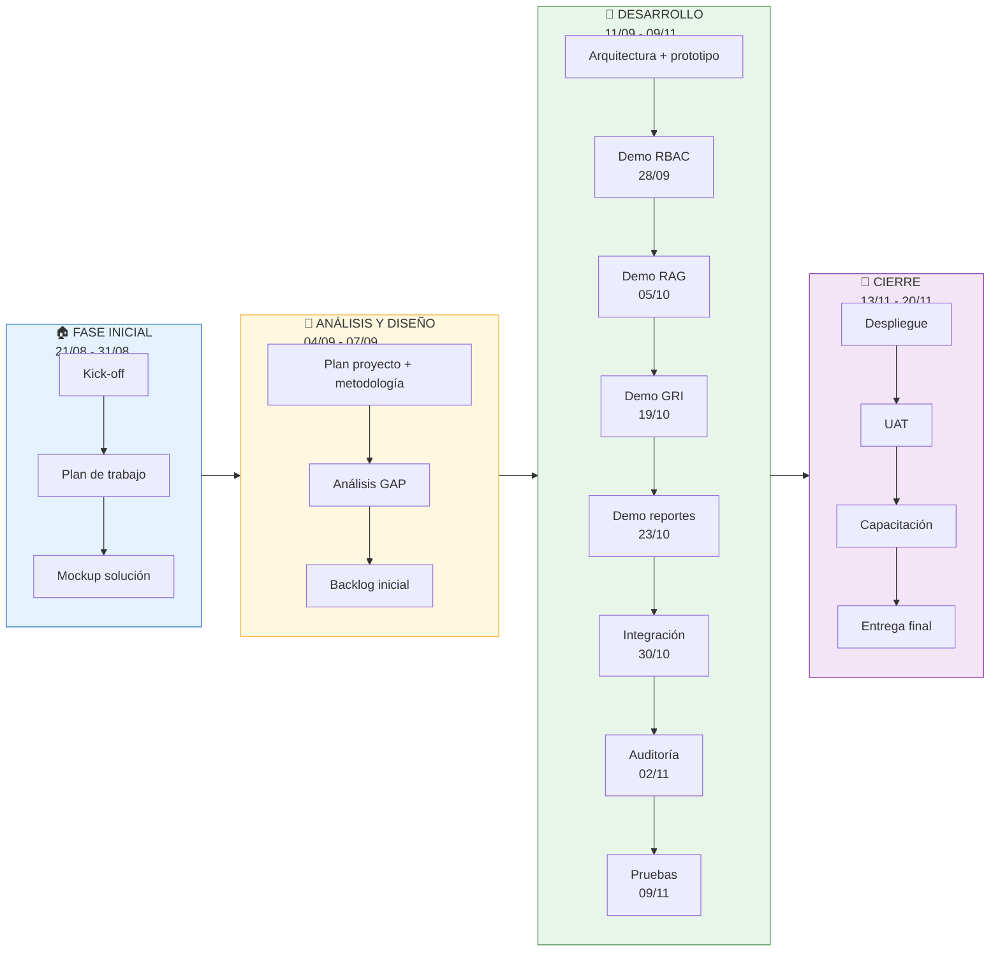
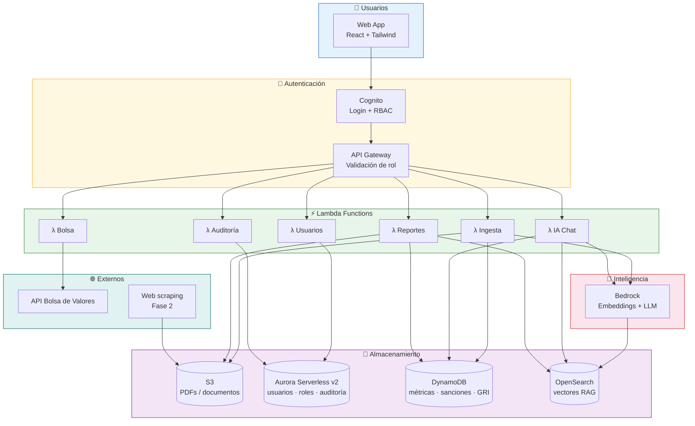

# Diagramas de Procesos (Mermaid)

Diagramas de procesos completos de la plataforma Igualab. Renderizables en Obsidian. Basados en el Plan de Proyecto oficial y el vault actualizado.

> 🧭 **Dos vistas complementarias:** este documento es la **vista técnica** (servicios, almacenamiento e infraestructura: Cognito, Lambda, S3, Bedrock, OpenSearch, DynamoDB, Aurora). La **vista de negocio** (solo actores, actividades y decisiones, sin stack) está en [[18 Diagramas de Procesos (Lógica de Negocio)]] — usa esa para presentar al cliente.

---

## 1. Proceso General de la Plataforma



---

## 2. Flujo de Autenticación y RBAC



---

## 3. Pipeline de Ingesta de Datos



---

## 4. Flujo del Motor RAG (Consulta IA)

```mermaid
flowchart TB
    START([🤖 Administrador pregunta]) --> VALIDAR

    subgraph VALIDAR["🔐 Validación"]
        VALIDAR --> COG[Cognito<br/>Verifica rol Administrador]
        COG --> GW[API Gateway<br/>Valida permisos]
    end

    GW --> PROCESAR

    subgraph PROCESAR["⚙️ Procesamiento"]
        PROCESAR --> PARSE[Parsea lenguaje natural]
        PARSE --> CLASSIFY{¿Tipo de consulta?}

        CLASSIFY -->|Documentos/RAG| SEMANTIC[🔍 Búsqueda semántica<br/>OpenSearch]
        CLASSIFY -->|Métricas| TABULAR[📊 Query estructurada<br/>DynamoDB/Aurora]
        CLASSIFY -->|Mixta| BOTH[Combina ambas]

        SEMANTIC --> CONTEXT[Recupera contexto + fuentes]
        TABULAR --> CONTEXT
        BOTH --> CONTEXT
    end

    CONTEXT --> GENERAR

    subgraph GENERAR["🧠 Generación de respuesta"]
        CONTEXT --> BED[Bedrock LLM<br/>Compone respuesta]
        BED -->         CITAS["Agrega citas<br/>1. Memoria p.142<br/>2. Res. OEFA"]
        CITAS --> FORMAT[Formatea respuesta<br/>con fuentes verificables]
    end

    FORMAT --> RESPUESTA([✅ Respuesta al Administrador<br/>Latencia < 5s])

    style START fill:#e8f5e9,stroke:#2e7d32
    style VALIDAR fill:#fff8e1,stroke:#f9a825
    style PROCESAR fill:#e3f2fd,stroke:#1565c0
    style GENERAR fill:#f3e5f5,stroke:#7b1fa2
    style RESPUESTA fill:#e8f5e9,stroke:#2e7d32
```

---

## 5. Flujo de Detección de Brechas GRI

```mermaid
flowchart TB
    DOC([📄 Documento ingestado<br/>Memoria/Reporte GRI]) --> EXTRACT

    subgraph EXTRACT["🔍 Extracción"]
        EXTRACT --> PARSE[Parseo del documento]
        PARSE --> CODES[Identifica códigos GRI<br/>GRI 305, GRI 401, etc.]
    end

    CODES --> ANALYSIS

    subgraph ANALYSIS["📊 Análisis de sustancia"]
        ANALYSIS --> MEASURE[Mide nivel de sustancia<br/>por código GRI]
        MEASURE --> COMPARE{¿Cumple estándar?}

        COMPARE -->|OK| OK[✅ Reporte completo<br/>Sustancia adecuada]
        COMPARE -->|Sub-reportado| SUB[⚠️ Brecha identificada<br/>Poca sustancia]
        COMPARE -->|Baja sustancia| BAJA[🟡 Débil<br/>Política sin casos]
    end

    subgraph ALERT["🚨 Alerta de prospección"]
        SUB --> ALERT_MSG[Oportunidad comercial<br/>Empresa con brecha GRI]
        BAJA --> ALERT_MSG
        ALERT_MSG --> REPORT[📄 Se incluye en<br/>reporte de prospección]
    end

    OK --> STORE[(DynamoDB<br/>Almacena resultado)]
    ALERT_MSG --> STORE

    style DOC fill:#e3f2fd,stroke:#1565c0
    style EXTRACT fill:#fff8e1,stroke:#f9a825
    style ANALYSIS fill:#e8f5e9,stroke:#2e7d32
    style ALERT fill:#ffebee,stroke:#c62828
```

---

## 6. Flujo de Análisis de Sanciones

```mermaid
flowchart TB
    MEM([📄 Memoria anual<br/>Repositorio Bolsa de Lima]) --> SCAN

    subgraph SCAN["🔍 Escaneo"]
        SCAN --> SEARCH[Busca sección<br/>Pasivos contingentes]
        SEARCH --> IDENTIFY[Identifica sanciones<br/>multas, procedimientos]
    end

    IDENTIFY --> EXTRACT

    subgraph EXTRACT["💰 Extracción de datos"]
        EXTRACT --> ENTITY[Entidad sancionadora<br/>OEFA, Ministerio, SBS]
        EXTRACT --> AMOUNT[Monto S/ cuantificable]
        EXTRACT --> YEAR[Año de la sanción]
        EXTRACT --> REASON[Motivo / incumplimiento]
    end

    ENTITY --> STORE
    AMOUNT --> STORE
    YEAR --> STORE
    REASON --> STORE

    STORE[(DynamoDB<br/>Sanciones por empresa)]

    STORE --> ALERT

    subgraph ALERT["🚨 Alerta de prospección"]
        ALERT --> RANK[Ranking de empresas<br/>por total sanciones]
        RANK --> OPP[Oportunidad: reparar<br/>reputación de empresa]
        OPP --> PDF[📄 Reporte PDF<br/>con sanciones cuantificadas]
    end

    style MEM fill:#e3f2fd,stroke:#1565c0
    style SCAN fill:#fff8e1,stroke:#f9a825
    style EXTRACT fill:#e8f5e9,stroke:#2e7d32
    style ALERT fill:#ffebee,stroke:#c62828
```

---

## 7. Flujo de Generación de Reportes PDF

```mermaid
flowchart TB
    START([📄 Administrador:<br/>Generar reporte]) --> CONFIG

    subgraph CONFIG["⚙️ Configuración"]
        CONFIG --> SELECT[Selecciona empresa]
        SELECT --> PERIOD[Define periodo<br/>2023 - 2025]
        PERIOD --> SECTIONS[Elige secciones<br/>Resumen · GRI · Sanciones]
    end

    SECTIONS --> COMPILE

    subgraph COMPILE["📝 Compilación automática"]
        COMPILE --> FETCH_GRI[Recupera brechas GRI<br/>OpenSearch]
        COMPILE --> FETCH_SAN[Recupera sanciones<br/>DynamoDB]
        COMPILE --> FETCH_MET[Recupera métricas<br/>ESG · Riesgo]
        FETCH_GRI --> BUILD[Construye PDF<br/>Plantilla A4]
        FETCH_SAN --> BUILD
        FETCH_MET --> BUILD
    end

    BUILD --> AUDIT

    subgraph AUDIT["📋 Auditoría"]
        AUDIT --> LOG[Registra en auditoría<br/>"Generó reporte"]
        LOG --> SAVE[(Aurora<br/>Tabla auditoría)]
    end

    BUILD --> DELIVER

    subgraph DELIVER["📤 Entrega"]
        DELIVER --> STORE_S3[Almacena en S3]
        STORE_S3 --> DOWNLOAD[Enlace de descarga]
        DOWNLOAD --> PREVIEW[Vista previa A4]
    end

    PREVIEW --> DONE([✅ PDF listo para descargar])

    style START fill:#e8f5e9,stroke:#2e7d32
    style CONFIG fill:#fff8e1,stroke:#f9a825
    style COMPILE fill:#e3f2fd,stroke:#1565c0
    style AUDIT fill:#f3e5f5,stroke:#7b1fa2
    style DELIVER fill:#e8f5e9,stroke:#2e7d32
    style DONE fill:#e8f5e9,stroke:#2e7d32
```

---

## 8. Flujo de Auditoría (Trazabilidad)

```mermaid
flowchart TB
    subgraph EVENTOS["📡 Eventos que se registran"]
        E1[🔑 Inicio de sesión]
        E2[🔄 Cambio de rol]
        E3[📥 Ingesta de datos]
        E4[📄 Generación de reporte]
        E5[⬇️ Descarga]
        E6[⚙️ Configuración]
        E7[❌ Intento fallido]
    end

    subgraph CAPTURE["📋 Captura"]
        E1 --> LOG[λ Auditoría]
        E2 --> LOG
        E3 --> LOG
        E4 --> LOG
        E5 --> LOG
        E6 --> LOG
        E7 --> LOG
    end

    LOG --> REGISTRO

    subgraph REGISTRO["💾 Registro"]
        REGISTRO --> DATA[Capture:<br/>• Fecha/hora<br/>• Usuario<br/>• Tipo de evento<br/>• Acción realizada]
        DATA --> AUR[(Aurora Serverless<br/>Tabla auditoría<br/>Solo lectura)]
    end

    AUR --> CONSULTA

    subgraph CONSULTA["🔍 Consulta (Superadmin)"]
        CONSULTA --> FILTER[Filtros:<br/>Tipo · Usuario · Fecha]
        FILTER --> VIEW[Tabla de auditoría<br/>Exportable CSV]
    end

    style EVENTOS fill:#ffebee,stroke:#c62828
    style CAPTURE fill:#fff8e1,stroke:#f9a825
    style REGISTRO fill:#e3f2fd,stroke:#1565c0
    style CONSULTA fill:#e8f5e9,stroke:#2e7d32
```

---

## 9. Procesos por Fases del Proyecto



---

## 10. Arquitectura AWS (Flujo de componentes)



---

## 🔗 Relacionado
- [[18 Diagramas de Procesos (Lógica de Negocio)]] · [[06 Arquitectura (AWS)]] · [[07 Flujos por Rol]] · [[08 Ingesta de Datos]] · [[15 Arquitectura de Solución]] · [[16 Diagramas de Secuencia]] · [[17 Diagrama de Casos de Uso]]
