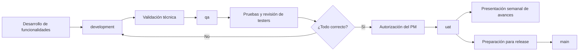
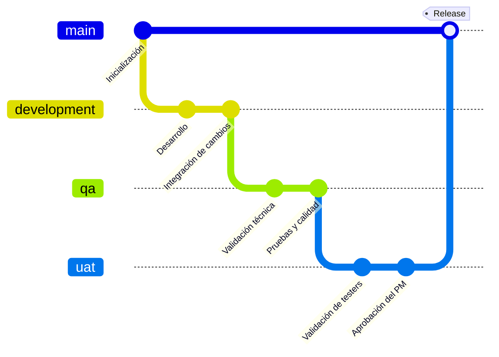

# 🏗️ Infraestructura, Repositorios y Flujo Git — Igualab

> **Proyecto:** Igualab — Plataforma de analítica de sostenibilidad (RAG).
> **Curso:** CS3081 · **Fecha:** 2026-09-17.
> **Objetivo:** dejar por escrito la convención de repositorios, el flujo de ramas obligatorio y el pipeline de integración, para que el código pase correctamente por **testers** y **Jenkins**.

---

## 1. Repositorios del proyecto

| Componente | Nombre | URL | Rama por defecto |
|---|---|---|---|
| Frontend | `FE-IGUALAB` | https://github.com/ING-IGUALAB/FE-IGUALAB | `main` |
| Backend | `BCK-IGUALAB` | https://github.com/ING-IGUALAB/BCK-IGUALAB | `main` |
| Mock navegable (Vercel) | `igualab-mock` | https://github.com/lFunkwnon01/igualab-mock | `main` |

> **Nomenclatura aplicada:** al ser un **único frontend + único backend**, corresponde `FE-{PROYECTO}` y `BCK-{PROYECTO}` → **cumple**. Si en el futuro se separan módulos (microfrontends/microservicios) se usará `FE-{MODULO}-IGUALAB` / `MS-{MODULO}-IGUALAB`.

> El repo `igualab-mock` es el **prototipo** (no es producto). El producto son `FE-IGUALAB` y `BCK-IGUALAB`.

---

## 2. Flujo de ramas obligatorio

```text
development → qa → uat → main
```

| Rama | Propósito | Regla |
|---|---|---|
| `development` | Desarrollo diario e integración de cambios. | Todos pueden `push`. No pasa a `qa` hasta que funcione. |
| `qa` | Validación técnica y funcional (SonarQube, tests, testers). | Requiere validación técnica previa. |
| `uat` | Presentación semanal de avances y validación de testers. | Pase **solo** con testers OK + autorización del **PM**. |
| `main` | Release. | **Protegida. Prohibido `push` directo.** |





> Regla general: **Desarrollar en `development`, validar en `qa`, obtener aprobación y presentar en `uat`. Nunca `push` directo a `main`.**

---

## 3. Estado actual de los repos (2026-09-17)

| Repo | `development` | `qa` | `uat` | `main` |
|---|---|---|---|---|
| `BCK-IGUALAB` | activo (código) | existe | = `main` (release actual) | solo `README.md` |
| `FE-IGUALAB` | activo (código) | existe | = `main` (release actual) | solo `README.md` |

- Las 4 ramas existen en ambos repos. ✅
- `main` y `uat` apuntan al mismo commit (release actual publicado). `development` va por delante.
- No hay evidencia de Pull Requests ni de pipeline CI en los repos: **pendiente** validar con los TA's.

### Contenido detectado en `development`
- **Backend (`BCK-IGUALAB`):** FastAPI · `app/{main,config,database,dependencies,security,audit,email_service,logging_config,request_id,exception_handlers}.py` · `app/routers/{auth,usuarios}.py` · `app/services/{auth_service,usuario_service}.py` · `app/models/{usuarios,auditoria}.py` · `tests/` (pytest) · `Dockerfile` + `docker-compose.yml` · `scripts/` (crear tablas, superadmin).
- **Frontend (`FE-IGUALAB`):** React + Vite + TypeScript + Tailwind · `src/pages/{Login,Asistente,Ingesta,Reportes,Descargas,Auditoria,Usuarios,MiCuenta,Restablecer}.tsx` · `src/api/{auth,usuarios,client}.ts` · `src/auth/`, `src/components/`, `src/lib/` · `Dockerfile` + `nginx.conf` + `.env.{development,qa,uat}.example`.

---

## 4. Configuración de repositorios y Jenkins

Requisitos del curso:
1. **Agregar a los TA's como administradores** de ambos repositorios.
2. Configurar la sección de repositorios según la imagen de la guía (permisos de webhooks/colaboradores).
3. **No** crear cuentas ni integrar Jenkins por cuenta propia: esperar la **plantilla de configuración** que entregará el curso y adaptarla con IA al proyecto.

Servicios que se incorporarán progresivamente:
- `qa`: **SonarQube**, tests unitarios, validaciones de calidad y **pruebas de testers**.
- Pipeline **Jenkins** para despliegue de `development → qa → uat → main`.

**Estado de credenciales:** pendientes de entrega por el curso. No integrar aún.

---

## 5. Checklist de cumplimiento (marcar al cerrar)

- [ ] `FE-IGUALAB` y `BCK-IGUALAB` con `main` protegida (sin `push` directo).
- [ ] TA's agregados como administradores.
- [ ] Fijar regla de PR obligatorio hacia `qa`/`uat`/`main`.
- [ ] SonarQube ejecutándose en `qa`.
- [ ] Tests unitarios en backend (pytest) y frontend con umbral mínimo.
- [ ] Jenkins configurado desde la plantilla oficial.
- [ ] `development` no pasa a `qa` sin check verde local.
- [ ] `qa` no pasa a `uat` sin testers + autorización del PM.
- [ ] Releases etiquetados en `main` desde `uat`.

---

## 6. Responsables

| Rol | Persona | Responsabilidad de flujo |
|---|---|---|
| PM / Scrum Master | Fabricio Ladera | Autoriza `qa → uat`. |
| Backend | Juan Marcelo Ferreyra | `push` en `development`, `BCK-IGUALAB`. |
| Frontend | Juan Renato Flores | `push` en `development`, `FE-IGUALAB`. |
| Testers | Mauricio Gonzalez · Alonso Benites | Validación en `qa`/`uat`. |
| Analistas | Carlos Ordinola · Luis Millones | Trazabilidad RF/RNF ↔ pruebas. |
| PO (cliente) | Oscar Baldeón | UAT y aceptación. |
