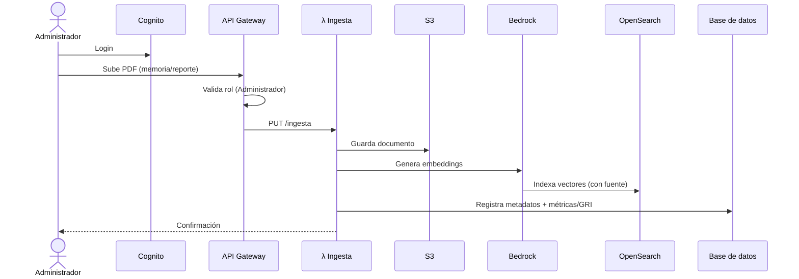
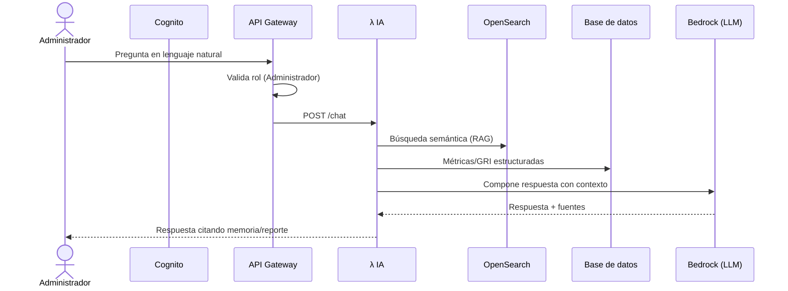
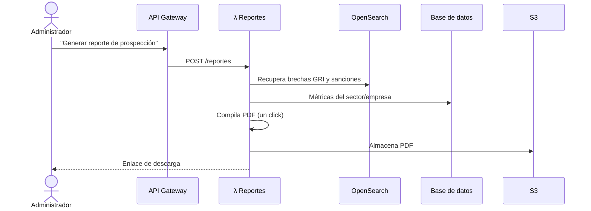
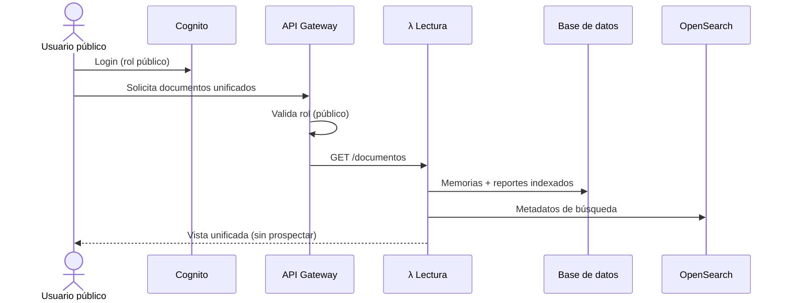

# 16 · Diagramas de Secuencia

Diagramas de secuencia (Mermaid) de los flujos principales de la plataforma Igualab. Renderizables en Obsidian. Complementan [[15 Arquitectura de Solución]] y [[07 Flujos por Rol]].

## 1. Ingesta de documento (Administrador — RF-06)

## 2. Consulta RAG del asistente (Administrador — RF-05)

## 3. Generación de reporte PDF (Administrador — RF-07)

## 4. Rol público (lectura unificada — RF-14)

## 🔗 Relacionado
- [[15 Arquitectura de Solución]] · [[07 Flujos por Rol]] · [[08 Ingesta de Datos]] · [[06 Arquitectura (AWS)]]
