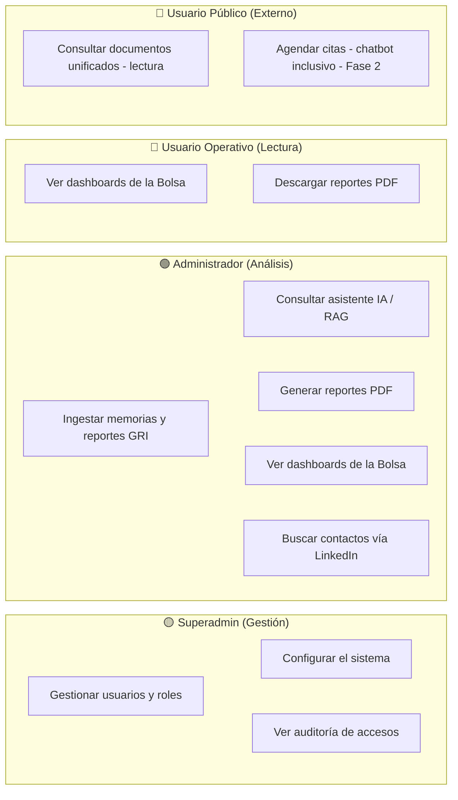

# 17 · Diagrama de Casos de Uso

Diagrama de casos de uso de la plataforma Igualab (Mermaid, renderizable en Obsidian). Complementa [[03 Roles y Control de Accesos]], [[04 Requerimientos Funcionales]] y [[16 Diagramas de Secuencia]].

## 👥 Actores
- **Superadmin (Gestión)**
- **Administrador (Análisis / Prospector)**
- **Usuario Operativo (Lectura interna)**
- **Usuario Público (Externo — lectura unificada)**

## 🧩 Diagrama
> Representado como `flowchart` porque tu versión de Mermaid en Obsidian no soporta `useCaseDiagram`. Cada actor (subgrafo) se enlaza a sus casos de uso.

## 🗂️ Mapeo Actor → Caso de uso → RF
| Actor | Caso de uso | RF |
|---|---|---|
| Superadmin | Gestionar usuarios y roles | RF-02 |
| Superadmin | Configurar el sistema | RF-01 / RNF-01 |
| Superadmin | Ver auditoría de accesos | RF-09 |
| Administrador | Ingestar memorias y reportes GRI | RF-06 / RF-11 |
| Administrador | Consultar asistente IA / RAG | RF-05 / RF-12 / RF-13 |
| Administrador | Generar reportes PDF | RF-07 |
| Administrador | Ver dashboards de la Bolsa | RF-08 |
| Administrador | Buscar contactos vía LinkedIn | RF-17 (exploratorio) |
| Usuario Operativo | Ver dashboards de la Bolsa | RF-08 |
| Usuario Operativo | Descargar reportes PDF | RF-07 |
| Usuario Público | Consultar documentos unificados (lectura) | RF-14 |
| Usuario Público | Agendar citas (chatbot inclusivo) | RF-10 (Fase 2) |

## 🔗 Relacionado
- [[03 Roles y Control de Accesos]] · [[04 Requerimientos Funcionales]] · [[16 Diagramas de Secuencia]] · [[15 Arquitectura de Solución]]
