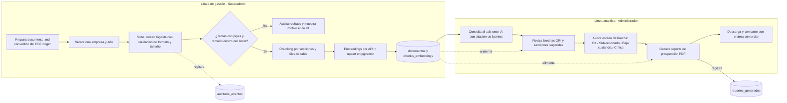
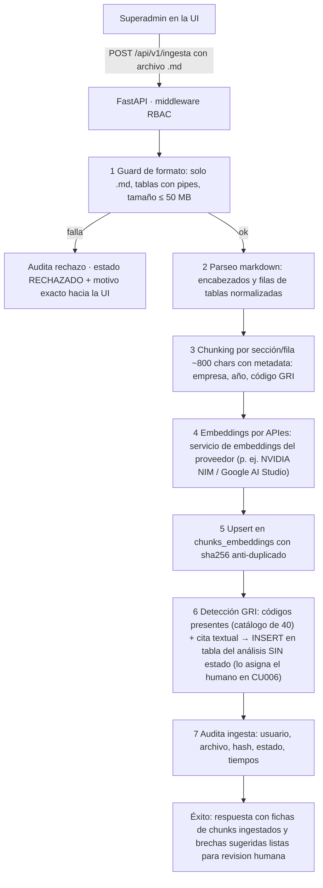
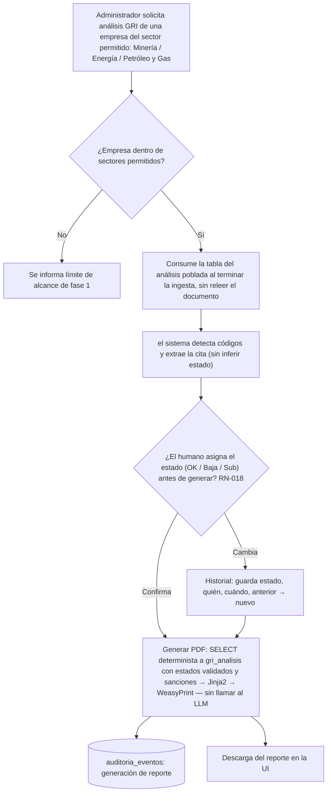

# 03 · Diagramas de Procesos TO-BE — FASE 1 (formato BPMN)

> Proceso to-be según el A&D actualizado y ajustado al plan de proyecto v1.2 + actas 4/5: **sin dashboard, sin Bolsa, sin LinkedIn**. Todos los flujos corresponden 1:1 con el mock fidelizado <https://igualab.vercel.app/>.
> El BPMN fuente está en `diagramas-BPMN/proceso_tobe_fase1.bpmn` (visualizable en `00-Documentación/bpmn/visor_bpmn.html`). Aquí se incluye versión mermaid para lectura rápida.

## 3.1 Proceso 1 — Flujo de negocio end-to-end (ingesta → análisis → prospección)

## 3.4 Mapeo de vistas del mock → pasos del proceso

| Vista del mock | Paso del proceso |
|---|---|
| Login (demoAccounts) | Proceso 1 · autenticación |
| Usuarios y roles (Superadmin) | Proceso 1 · gestión (RN-002, RN-003) |
| Ingesta de documentos | Proceso 2 completo |
| Auditoría de accesos | Consulta de `auditoria_eventos` |
| Asistente de IA (chat) | Proceso 3 (análisis y consulta) |
| Reportes de prospección / Descargar | Proceso 3 (generación y entregables) |

> Nota: los procesos **AS-IS** ya están en el documento A&D v1.0 (sección 5.1); el modelo **to-be** válido para FASE 1 es el de este documento. Los archivos `.bpmn` exportables (estándar BPMN 2.0, abribibles en bpmn.io / Camunda) están en la carpeta `diagramas-BPMN/`.
