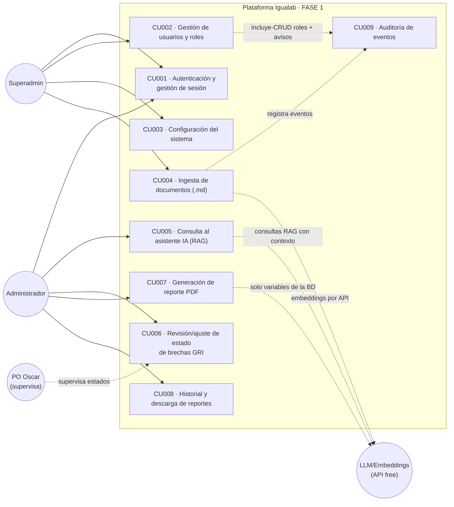
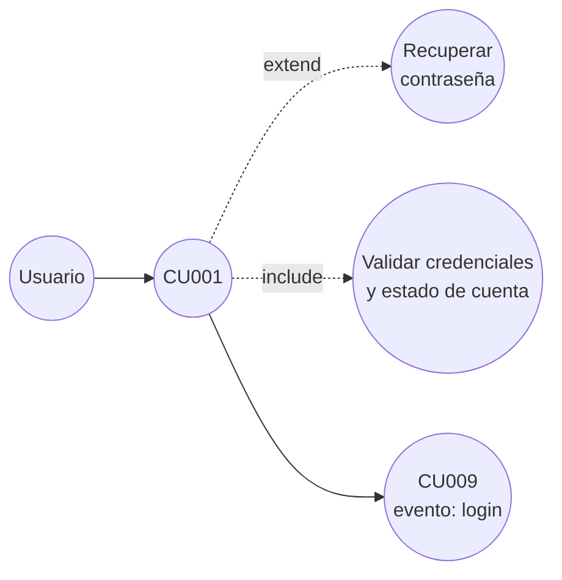
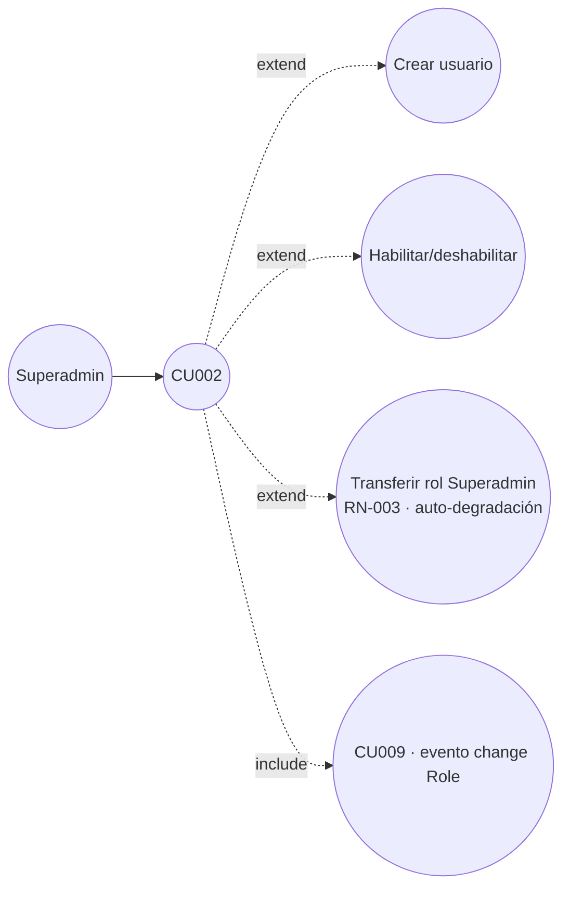
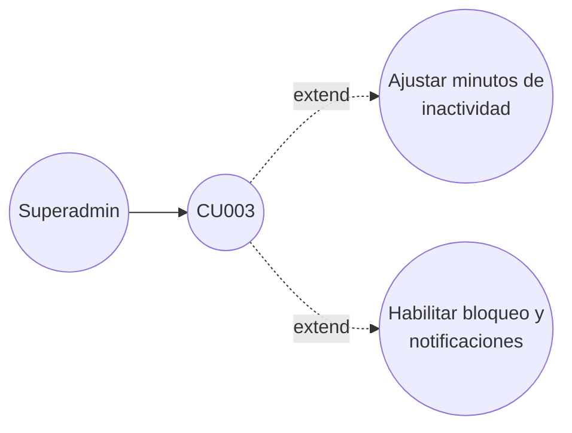
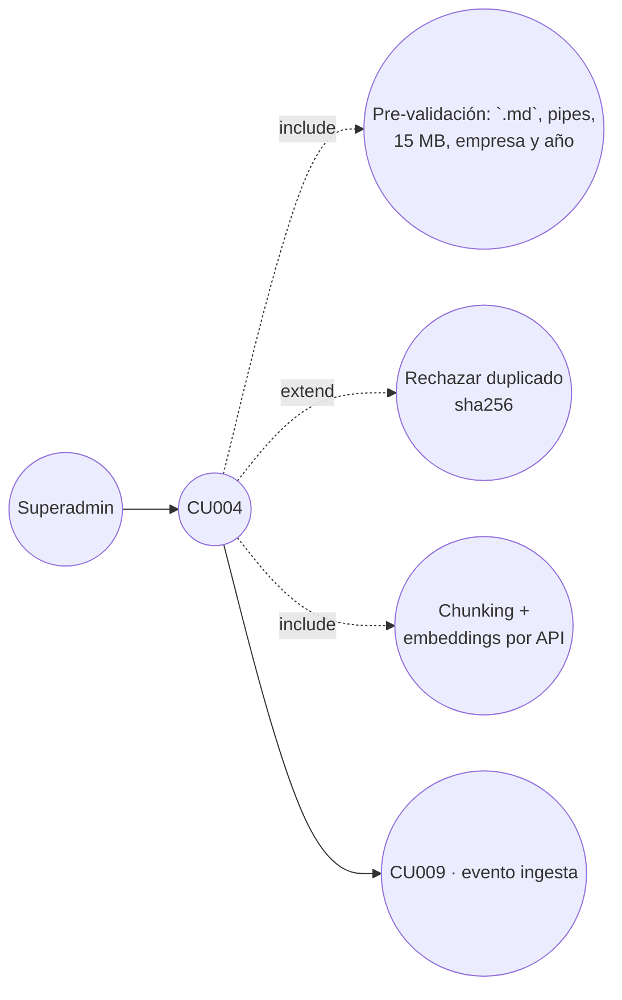
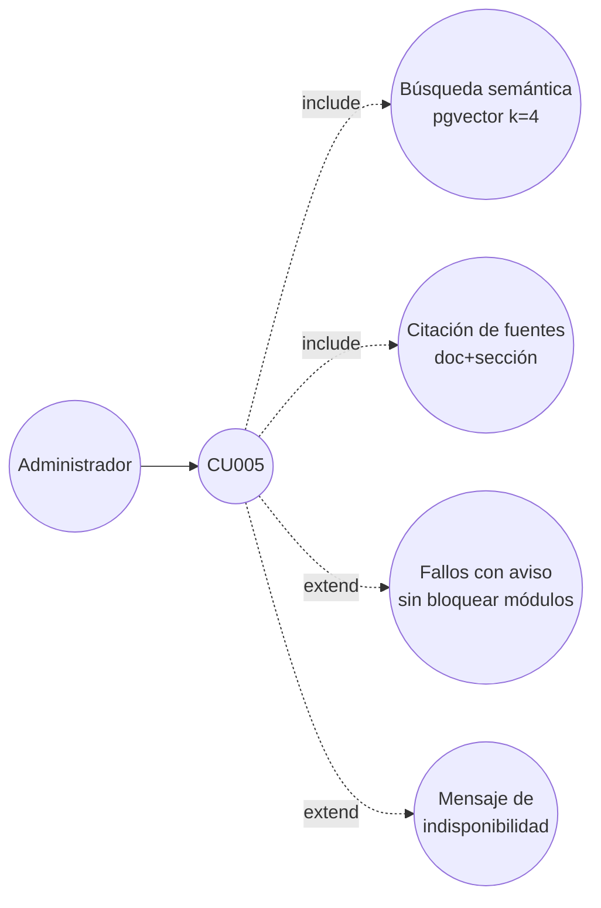
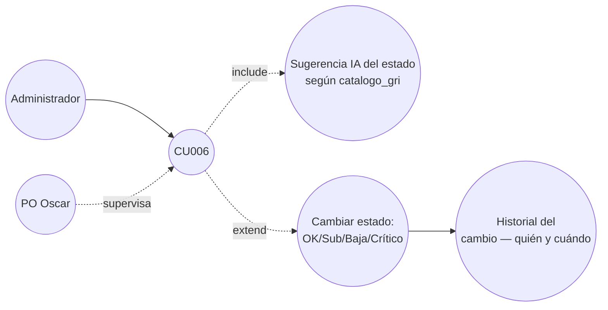
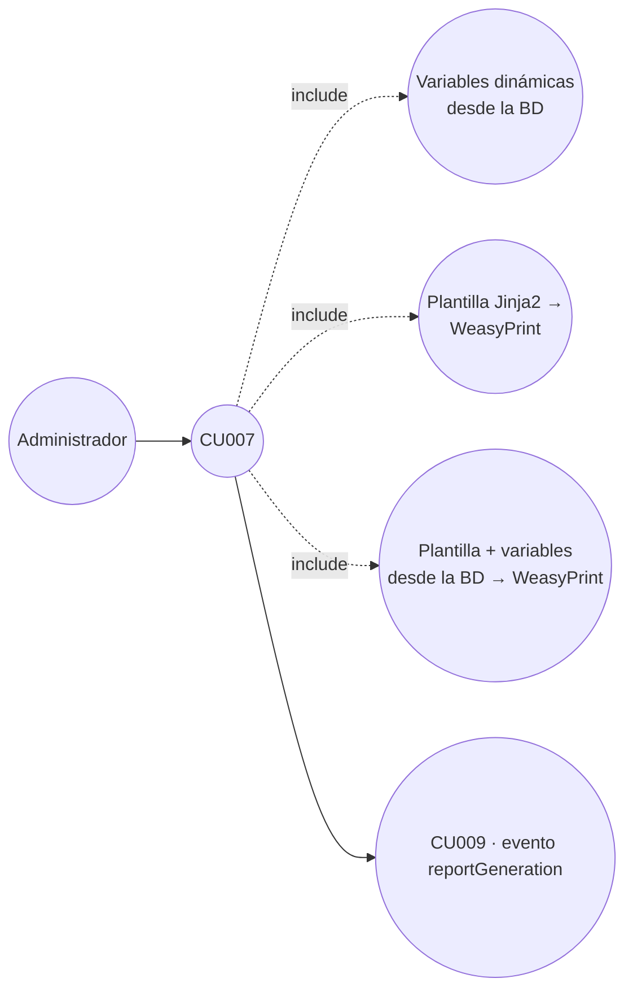
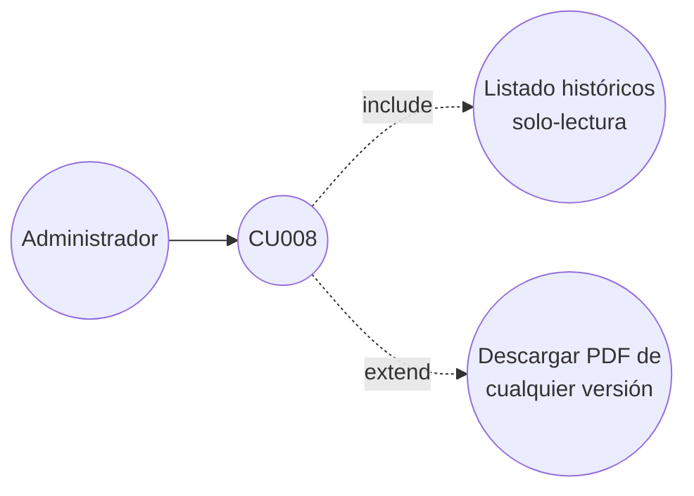
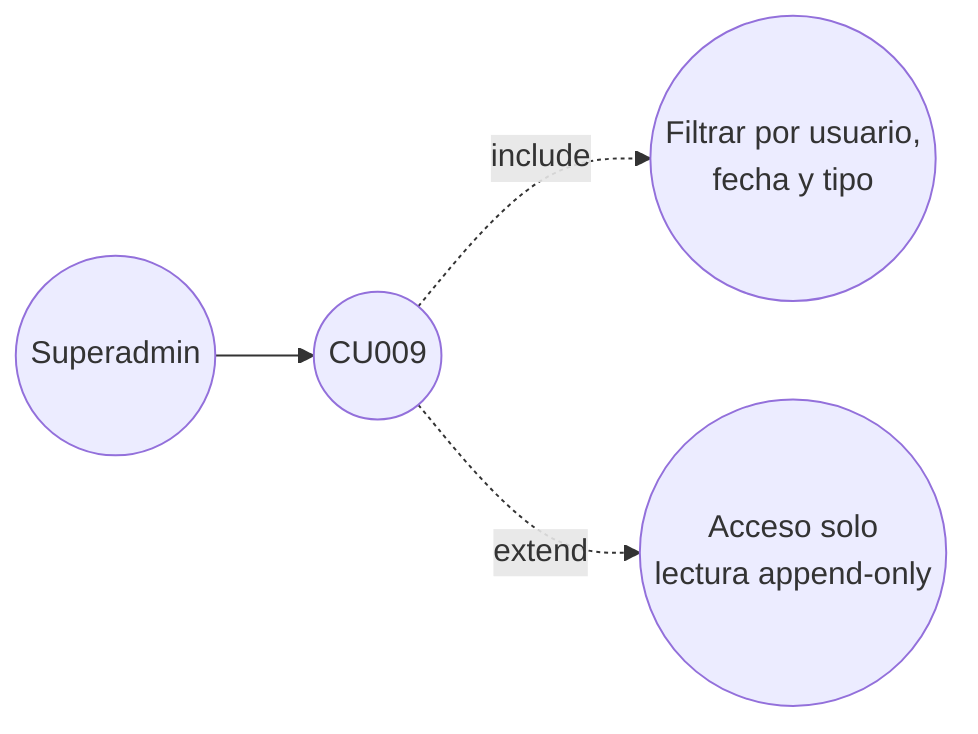

# 07 · Casos de Uso — Diagrama y Listado (FASE 1)

> **Numeración alineada al A&D v4 (14/09)**: los códigos RN/RF/RNF de este documento siguen la numeración del Análisis y Diseño (fuente única).

> Casos de uso del A&D v1.0 **depurados** según plan v1.2 y actas 4/5: se eliminan CU007 de Dashboards de Bolsa de Valores (REQ-16/19), el rol Usuario del mock CU010 LinkedIn (REQ-17) y el chatbot inclusivo (fase 2). Se retoman 9 CU **vivos en el mock fidelizado**.

## 7.1 Actores

- **Superadmin** (1 usuario — gestión de accesos e ingesta).
- **Administrador** (2 usuarios — explotación analítica; supervisa el PO).
- **PO (Oscar)** — supervisar (auditor de estados, no rol del sistema).
- **LLM & Embeddings**: sistema externo (API `:free` de OpenRouter para el chat; embeddings por API para la BD vectorizada). **Sin function calling en fase 1 → solo RAG simple.**

## 7.2 Diagrama general (mermaid)

## 7.3 Listado de casos de uso (empresa)

| Código | Nombre | CU padre | Actor(es) | Estado fase 1 |
|---|---|---|---|---|
| **CU001** | Autenticación y gestión de sesión (login, recuperación) | — | Ambos | Incluido |
| **CU002** | Gestión de usuarios y roles (con transferencia de Superadmin) | CU001 | Superadmin | Incluido |
| **CU003** | Configuración del sistema (inactividad, bloqueo, notificaciones) | CU001 | Superadmin | Incluido |
| **CU004** | Ingesta de documentos (` .md`, síncrona con guard) | CU001 | Superadmin | Incluido |
| **CU005** | Consulta al asistente de IA (RAG con citación) | CU001 | Administrador | Incluido |
| **CU006** | Revisión y ajuste de estado de brechas GRI (supervisión humana) | CU005 | Administrador | Incluido |
| **CU007** | Generación de reporte de prospección (PDF) | CU006 | Administrador | Incluido |
| **CU008** | Historial y descarga de reportes | CU007 | Administrador | Incluido |
| **CU009** | Auditoría de eventos del sistema | CU002 | Superadmin | Incluido |
| ~~CU007 (v1.0)~~ | ~~Dashboards de Bolsa de Valores~~ | — | — | **Eliminado** (acta 5 · REQ-16/19) |
| ~~CU010 (v1.0)~~ | ~~Búsqueda LinkedIn~~ | — | — | **Eliminado** (acta 5 · REQ-17) |
| CU-PF | Portal público | — | Público | **Diferido** (post-fase 1) |
| CU-CI | Chatbot inclusivo | — | — | **Fase 2** (mock existiia como CU013_fase_2) |

## 7.4 Diagramas por caso de uso (mermaid)

### CU001 — Autenticación y gestión de sesión

### CU002 — Gestión de usuarios y roles

### CU003 — Configuración

### CU004 — Ingesta de documentos

### CU005 — Consulta al asistente IA (RAG)

### CU006 — Revisión/ajuste de brechas (supervisión)

### CU007 — Generación de reporte PDF

### CU008 — Historial y descarga de reportes

### CU009 — Auditoría de eventos

> Los diagramas formales UML (plantuml) pueden generar a partir de estas especies de la especificación (documento 08) cuando se deseen incluir en el A&D exportable PDF.
