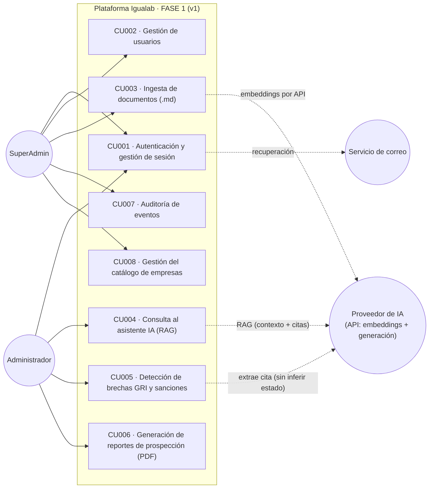
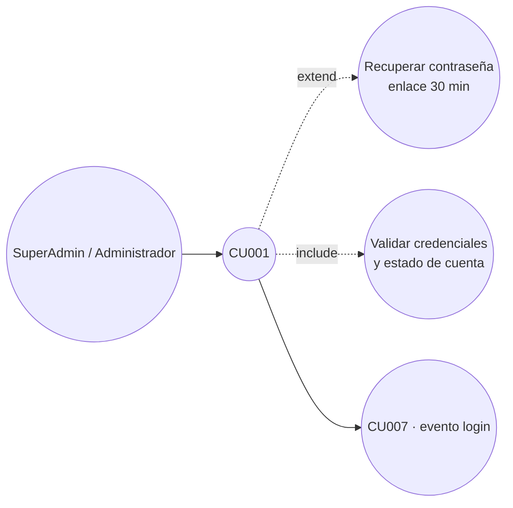
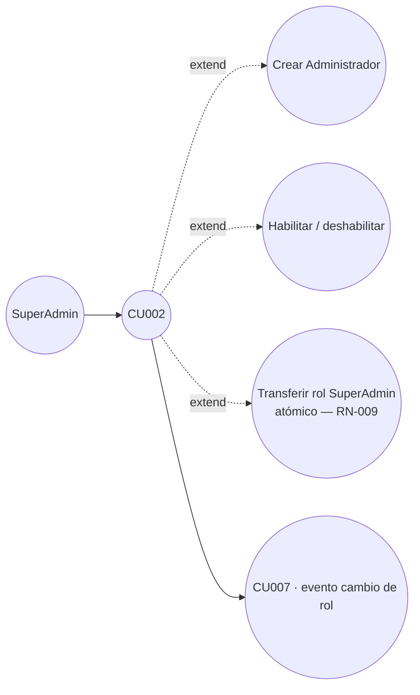
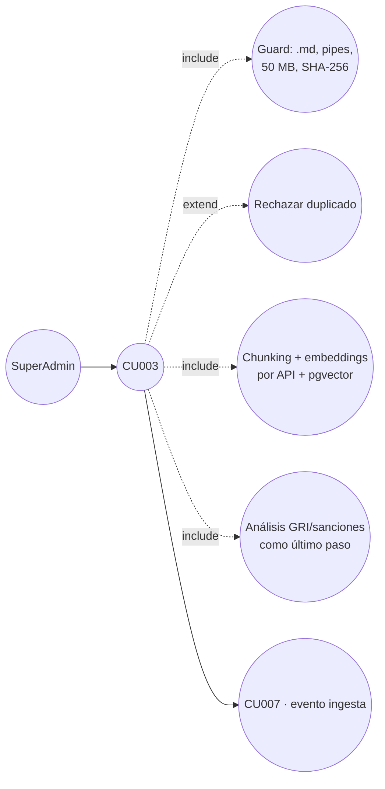
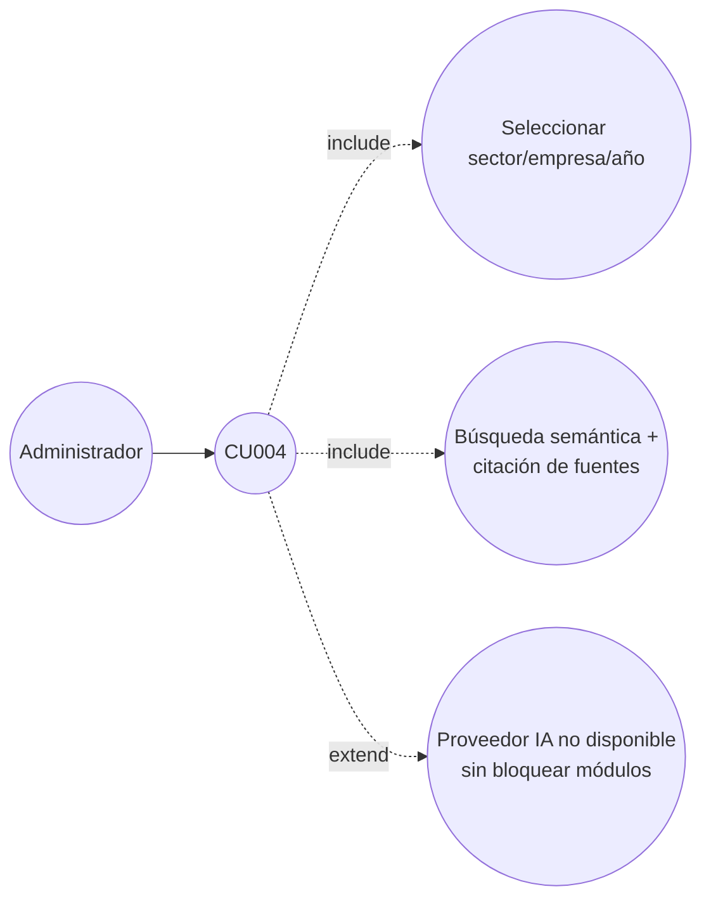
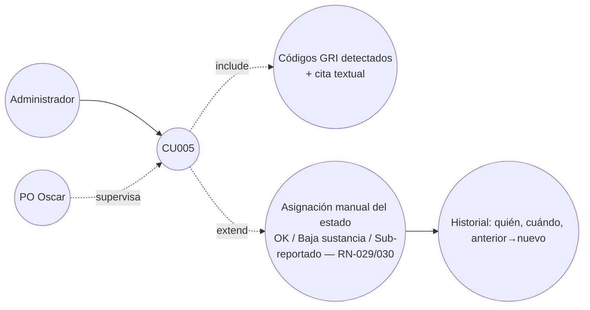
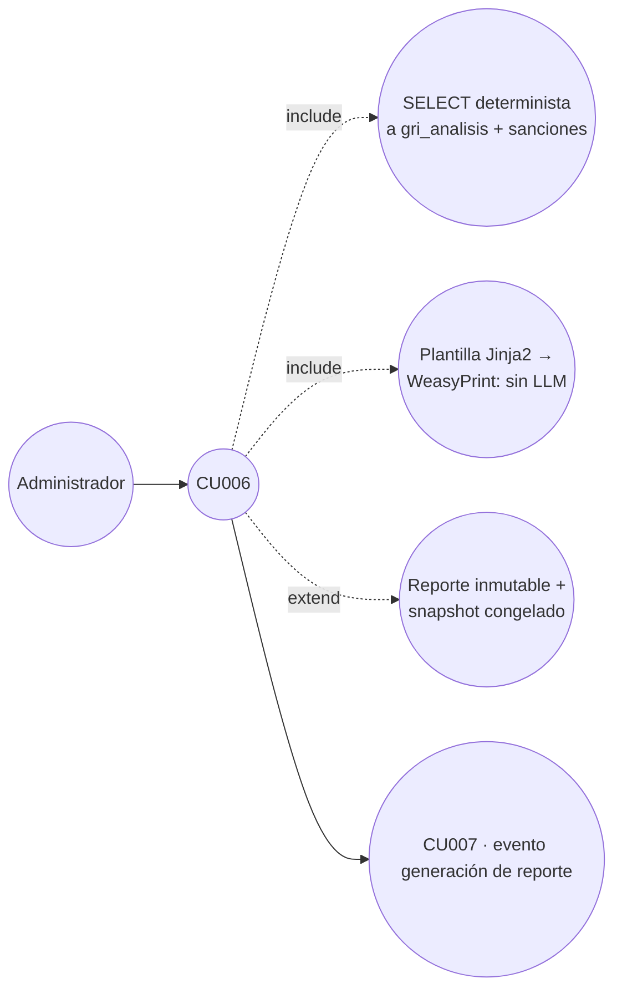
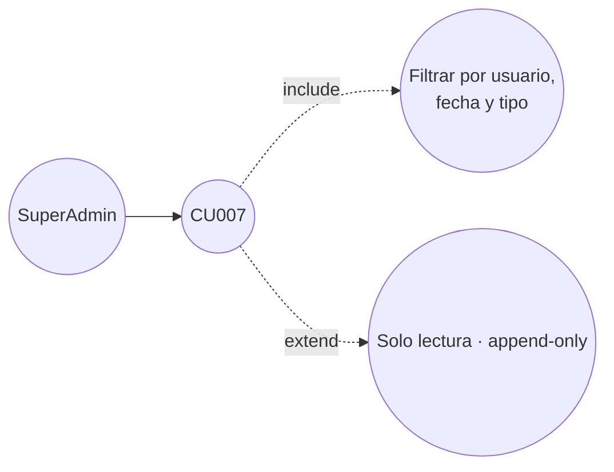
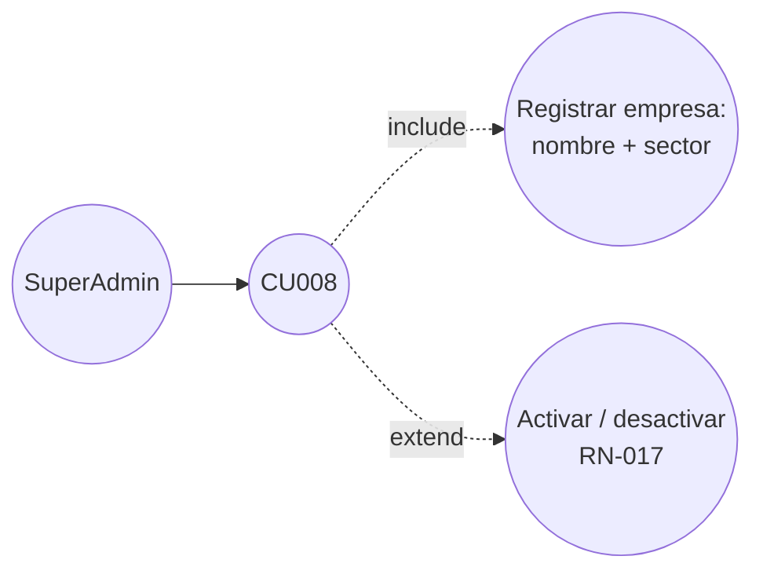

# 07 · Casos de Uso — Diagrama y Listado (FASE 1)

> **Numeración = A&D vigente** (`01-Mockups-y-Propuestas/analisis_y_diseno_oficial.pdf`, sección 7.2).
> Casos de uso de la **v1 (FASE 1)**: **CU001…CU008**. Se eliminaron los CU fuera de alcance (Bolsa, LinkedIn, chatbot/portal).

## 7.1 Actores

- **SuperAdmin** (1 persona — gestión): cuentas, catálogo de empresas, ingesta y auditoría. **No usa la IA.**
- **Administrador** (2 personas — explotación): consulta al asistente RAG, revisa/valida brechas y sanciones, y genera reportes.
- **Proveedor de IA (externo):** servicio por API que da *embeddings* (indexación semántica) y generación de respuestas. **Sin *function calling* en FASE 1 → RAG simple.**
- **Servicio de correo (externo):** envío del enlace de recuperación de contraseña.
- **PO (Oscar):** supervisa la validación de estados (rol humano de control, no rol del sistema).

## 7.2 Diagrama general (mermaid)

## 7.3 Listado de casos de uso

| Código | Nombre | CU padre | Actor(es) | Estado FASE 1 |
|---|---|---|---|---|
| **CU001** | Autenticación y gestión de sesión | — | SuperAdmin, Administrador | Incluido |
| **CU002** | Gestión de usuarios | — | SuperAdmin | Incluido |
| **CU003** | Ingesta de documentos (memorias y reportes GRI) | — | SuperAdmin | Incluido |
| **CU004** | Consulta al asistente de IA (RAG) | — | Administrador | Incluido |
| **CU005** | Detección de brechas GRI y sanciones | CU003 | Administrador | Incluido |
| **CU006** | Generación de reportes de prospección (PDF) | CU005 | Administrador | Incluido |
| **CU007** | Auditoría de eventos del sistema | — | SuperAdmin | Incluido |
| **CU008** | Gestión del catálogo de empresas | — | SuperAdmin | Incluido |
| ~~CU (Bolsa)~~ | ~~Dashboards de Bolsa de Valores~~ | — | — | **Eliminado** (acta 5 · REQ-16/19) |
| ~~CU (LinkedIn)~~ | ~~Búsqueda vía LinkedIn~~ | — | — | **Eliminado** (acta 5 · REQ-17) |
| CU (portal) | Portal público · chatbot inclusivo | — | — | **FASE 2 (v2)** |

## 7.4 Diagramas por caso de uso (mermaid)

### CU001 — Autenticación y gestión de sesión

### CU002 — Gestión de usuarios

### CU003 — Ingesta de documentos (.md)

### CU004 — Consulta al asistente IA (RAG)

### CU005 — Detección de brechas GRI y sanciones

### CU006 — Generación de reportes de prospección (PDF)

### CU007 — Auditoría de eventos

### CU008 — Gestión del catálogo de empresas

