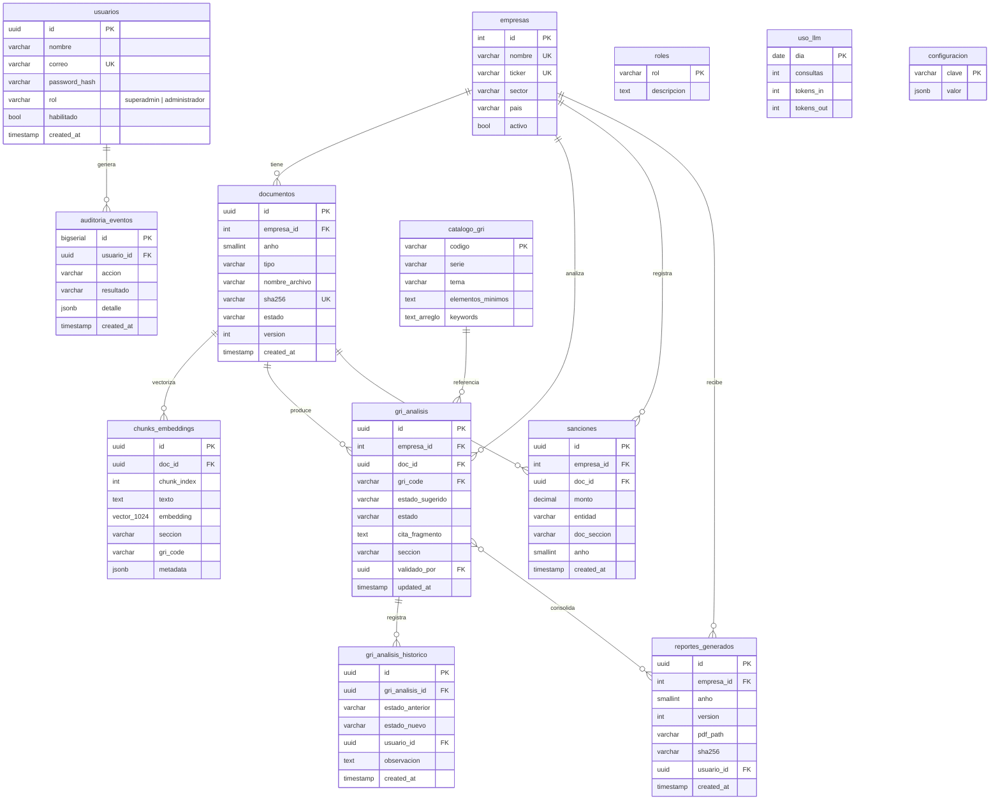

# 02 · Base de Datos — Diagrama ERD, Diseño detallado y Reglas Semánticas (FASE 1)

> **Numeración alineada al A&D v6 (14/09)**: los códigos RN/RF/RNF de este documento siguen la numeración del Análisis y Diseño (fuente única).

> Fuente de verdad: **Plan de Proyecto v1.2** + actas 4/5 · Norma: **GES/GAP** (conceptual → lógico → físico semántico) · Escenario: 3 usuarios (1 Superadmin + 2 Administradores) · 14 tablas.

**Diagrama ERD v2 (elaborado por el equipo, con los 7 cambios aplicados y verificado contra el diseño) — [[Diagrama_bd.png]]:**

![[Diagrama_bd.png]]

*Lectura del ERD: roles → usuarios → (auditoria_eventos / uso_llm diario) · empresas → documentos → chunks_embeddings (vector 1024) → gri_analisis (con gri_analisis_historico, usando catalogo_gri como referencia) → reportes_generados → reporte_detalle_snapshot · sanciones (con cita) y configuracion como soporte. Sin `pais` (fase 1 = BVL-Perú). Los 7 cambios aplicados: gri_analisis renombrada · 1:N documentos→chunks · chunk_id_hash UNIQUE · observacion condicional (RF-025) · resumen_ejecutivo determinístico · vigente_desde en catalogo_gri · CHECK num_nonnulls en reporte_detalle_snapshot. Justificación del modelo completo: [[05-Analisis-Por-que-Existen-las-Tablas]].*

---

**A continuación, el contenido detallado (sin cambios):**

> Motor: **PostgreSQL 16 + extensión pgvector** (base de datos **vectorizada** que sustenta el RAG).
> Norma del curso: diseño por **GES/GAP** (modelo conceptual → modelo lógico → modelo físico), con especificación textual de cada tabla (paso previo obligatorio al **Diccionario de Datos**, que se completa en `03-Diccionario-de-Datos.md` una vez congelado este diseño).
> Escenario de carga real: **3 usuarios** (1 Superadmin + 2 Administradores) por eso la ingesta es síncrona (RN-012).

## 1. Modelo conceptual (entidades y relaciones, texto)

Las entidades del dominio son 12. El lector debe tener clara la cadena principal del negocio:

**empresa → documento (`.md`) → chunks (vectorizados) → análisis GRI/sanciones → reporte PDF**, y alrededor: **usuarios** (quién hace qué), **auditoría** (todo lo sensible), **catálogo GRI** (el estándar de referencia, no lo define la IA) y **uso_llm/configuración** (soporte operativo).

Relaciones (1:N salvo indicación):

1. Una **empresa** tiene muchos **documentos** (memorias y reportes por año).
2. Un **documento** se vectoriza en muchos **chunks_embeddings** (1 documentos : N chunks; el chunk es indivisible).
3. Un **documento** produce muchas filas de **gri_analisis** (una por código GRI analizado) y puede citar muchas **sanciones**.
4. El **catalogo_gri** (N:M lógico con gri_analisis) **define la referencia** del indicador: una fila de análisis corresponde a un código del catálogo.
5. Cada **gri_analisis** registra su **historico de cambios de estado** (N:M 1:N) — quién, cuándo, de qué a qué (RN-018).
6. Un **reporte_generado** pertenece a una empresa y **consolida** (N:M, mediante snapshot) las brechas con estado final + sanciones a su fecha de emisión.
7. Todo **usuario** genera eventos en **auditoria_eventos** (append-only).
8. **uso_llm** guarda el consumo diario del asistente (RN-024); **configuracion** guarda los parámetros del sistema.

## 2. Modelo lógico — Diagrama ER (mermaid)

## 3. Especificación física y detallada por tabla

> Convención GAP: para cada tabla se define qué **es**, sus **columnas** (tipo físico), la **llave**, las **restricciones de integridad** y las **reglas semánticas** (invariantes que el negocio exige y que la BD debe garantizar o verificar).

### 3.1 `usuarios`
- **Qué**: registro de las 3 personas del proyecto (1 Superadmin + 2 Administradores). Ningún "Usuario" público en fase 1 (acta 4 · REQ-10).
- **Columnas**: `id UUID PK default gen_random_uuid()` · `nombre VARCHAR(120) NOT NULL` · `correo VARCHAR(160) NOT NULL UNIQUE (case-insensitive via índice funcional lower(correo))` · `password_hash TEXT NOT NULL` (bcrypt/argon2 — RNF-01) · `rol VARCHAR(20) NOT NULL CHECK (rol IN ('superadmin','administrador'))` · `habilitado BOOLEAN NOT NULL DEFAULT true` · `created_at TIMESTAMPTZ NOT NULL DEFAULT now()`.
- **Reglas semánticas (RS)**:
  - **RS-01 (RN-002)**: en toda la tabla existe **exactamente 1 fila con `rol='superadmin'`**, **con independencia de su estado de habilitación**. Se garantiza con índice único: `CREATE UNIQUE INDEX uq_un_solo_superadmin ON usuarios ((rol)) WHERE rol='superadmin';` (sin filtro de `habilitado`, conforme a RN-002; además RF-013 impide deshabilitar al SuperAdmin). Al transferir el rol, la transacción (UPDATE doble) es **atómica**: la cuenta destino sube y la de origen baja en el mismo commit (RNF-011) — nunca hay 0 ni 2 SuperAdmin.
  - **RS-02 (RN-007)**: deshabilitar un usuario invalida sus tokens (los JWT llevan `iat`; en invalidación se registra en auditoría y se exige re-login).
  - **RS-03 (RN-001)**: sin usuario vigente no existe operación (todo FK `usuario_id` proviene de `usuarios.habilitado=true`).

### 3.2 `roles`
- **Qué**: catálogo cerrado de los 2 perfiles (para integridad referencial del RBAC). `rol PK ('superadmin','administrador')`, `descripcion TEXT` con la definición del acta 4 (REQ-10). No admite nuevos roles en fase 1.

### 3.3 `empresas`
- **Qué**: catálogo de empresas analizables que el Superadmin gestiona (RF-017).
- **Columnas**: `id SERIAL PK` · `nombre VARCHAR(160) NOT NULL UNIQUE` · `ticker VARCHAR(12) UNIQUE` · `sector VARCHAR(40) NOT NULL CHECK (sector IN ('Minería','Energía','Petróleo y Gas'))` (**RN-016 hardcode en la BD**) · `activo BOOLEAN DEFAULT true`.
- **Nota de alcance (decisión del equipo)**: en fase 1 **no existe columna `pais`** — todas las empresas cotizan en la **Bolsa de Valores de Lima (Perú)**, el foco de fase 1. Si el día de mañana la herramienta se usa en otro país (fase 2+), se añadiría `pais` con default 'Perú' sin romper nada (migración prevista en el checklist).
- **RS**: **RS-04 (RN-016)**: el análisis solo alcanza empresas del CHECK de sector; cualquier flujo que intente analizar otra empresa ni siquiera encuentra filas habilitadas. Empresas `activo=false` no aparecen en la selección de ingesta.

### 3.4 `documentos`
- **Qué**: cada `.md` subido (memoria anual o reporte de sostenibilidad) con su estado del pipeline.
- **Columnas**: `id UUID PK` · `empresa_id INT REFERENCES empresas(id)` · `anho SMALLINT NOT NULL CHECK (anho BETWEEN 2000 AND 2100)` · `tipo VARCHAR(30) CHECK (tipo IN ('memoria_anual','reporte_sostenibilidad'))` · `nombre_archivo VARCHAR(255)` · `ruta_origen TEXT` (copia del .md en disco del backend, RN-030) · `sha256 CHAR(64) NOT NULL UNIQUE` (**RN-014 anti-duplicado**) · `estado VARCHAR(20) CHECK (estado IN ('indexado','observado','rechazado'))` **RN-011** · `motivo TEXT NULL` (texto exacto del guard o del observado) · `version INT NOT NULL DEFAULT 1` (se incrementa por re-sube con contenido distinto, RN-015) · `chunks_count INT NULL` (éxito: nº chunks) · `created_by UUID REFERENCES usuarios(id)` · `created_at TIMESTAMPTZ` · **`UNIQUE(empresa_id, anho, tipo)`** (unicidad documental por empresa/año/tipo — A&D v2 RN-010).
- **RS**: **RS-05 (RN-013)**: `empresa_id` y `anho` obligatorios (sin asociación no se ingesta). **RS-06 (RN-012)**: es la "máquina de estados" síncrona de la ingesta — un documento solo existe si la operación de subida terminó (no hay estados intermedios residuales; en fallo se transacciona completo). **RS-07 (RN-030)**: **sin DELETE** (revoked); los rechazos también quedan guardados para trazabilidad.

### 3.5 `chunks_embeddings` — la BD vectorizada (físico)
- **Qué**: cada fragmento textual (chunk) con su **embedding**, núcleo del RAG.
- **Columnas**: `id UUID PK` · `doc_id UUID REFERENCES documentos(id) ON DELETE CASCADE` (solo si un día se eliminara el doc, nunca en fase 1) · `chunk_index INT` · `texto TEXT NOT NULL` · **`embedding VECTOR(N)`** (pgvector; N según el modelo del proveedor: p. ej. 1024) · `seccion VARCHAR(200)` (encabezado markdown del chunk — llave de la cita) · `gri_code VARCHAR(12) NULL` (heredada del encabezado de la tabla GRI) · `n_tabla INT NULL` (n.º de fila dentro de la tabla origen) · `metadata JSONB` (empresa_id, año, tipo doc, página/parrafo) · `chunk_id_hash CHAR(64) NOT NULL UNIQUE` (sha256 del texto — **RNF-16.idempotencia**: re-ingesta no duplica chunks).
- **Físico**:
  - `CREATE EXTENSION IF NOT EXISTS vector;`
  - `ALTER TABLE chunks_embeddings ALTER COLUMN embedding TYPE vector(1024);`
  - Índice **HNSW**: `CREATE INDEX idx_chunks_hnsw ON chunks_embeddings USING hnsw (embedding vector_cosine_ops) WITH (m=16, ef_construction=64);`
  - Búsqueda tipo: `ORDER BY embedding <=> :q LIMIT 4` (k=4, cosine).
  - Parámetros elegidos para ~cientos de documentos en el server universitario (RNF-19/21): HNSW es o(√n) en el fseek.
- **RS**: **RS-08**: `doc_id + chunk_index` es único por versión de documento; a su vez `chunk_id_hash` es único global (el mismo contenido nunca se indexa dos veces). **RS-09**: la metadata es **fuente de las citas**: `citación = documentos.nombre_archivo + chunks_embeddings.doctor` — nunca correspondiente a la mencionada por el LLM (RN-022/RNF, post-check ids).

### 3.6 `catalogo_gri`
- **Qué**: **el estándar**: tabla precargada (seed) del GRI Universal + tópicos de la serie 200/300/400. Define el "GRI óptimo" (pregunta explícita del PO).
- **Columnas**: `codigo VARCHAR(12) PK` (p. ej. 'GRI 403') · `serie VARCHAR(3) CHECK IN ('100','200','300','400')` · `tema VARCHAR(120)` · `elementos_minimos TEXT` (checklist de qué debe reportar una empresa completa para el estado OK — descritos con el PO) · `keywords TEXT[]` (palabras clave de evidencia para la detección determinista) · `vigente_desde SMALLINT` (año de la versión del estándar).
- **RS**: **RS-10 (RN-017)**: la detección de brechas **lee de aquí**; el modelo no sugiere indicadores inexistentes: solo se registran códigos existentes en `catalogo_gri`. **RS-11**: conservación de la versión del estándar analizada en cada fila de análisis (si GRI actualiza, los análisis anteriores no mutan).

### 3.7 `gri_analisis`
- **Qué**: fila **brecha por empresa, documento, código GRI** — incl. estados OK (RN-019: todo se registra). Se **llena automáticamente al terminar la ingesta**: cuando el pipeline del `.md` termina, el motor de análisis corre contra `catalogo_gri` y persiste las filas con `estado_sugerido` **en la misma operación síncrona** → la generación de reporte **SOLO consulta esta tabla (SELECT determinista), nunca al LLM**.
- **Columnas**: `id UUID PK` · `empresa_id` · `doc_id` · `gri_code` FK→catalogo_gri · `estado_sugerido VARCHAR(20)` **ELIMINADO en v2** (el A&D v2 prohíbe la inferencia: el estado lo asigna solo el humano) · `estado VARCHAR(20) CHECK IN ('OK','BAJA SUSTANCIA','SUB-REPORTADO')` — **3 estados únicos, asignados manualmente por el Administrador (RN-018 / A&D v2 RN-010)** · `cita_fragmento TEXT` (chunk referenciado) · `seccion VARCHAR(200)` · `observacion TEXT NULL` (exigida si el humano cambió el estado, RF-025) · `validado_por UUID NULL REFERENCES usuarios(id)` · `updated_at TIMESTAMPTZ`.
- **RS**: **RS-12 (RN-018)**: `estado` (final) solo es visible para el reporte cuando `validado_por IS NOT NULL` — la generación bloquea si existen filas `NULL` (CU007 paso 2). **RS-13 (RN-020)**: toda fila con fuente `cita_fragmento + seccion`; `estado_sugerido` se calcula con las **reglas deterministas** de `catalogo_gri` (elementos mínimos), nunca por criterio libre del LLM. **RS-14 (RN-019)**: los códigos OK **también** se persisten con cita — tabla `gri_analisis` sin filtrado de resultado.

- **RS-22 (caso borde — sin sanciones identificadas / empresa "sana")**: si el análisis no identifica sanciones, la tabla `sanciones` **quedará vacía para esa empresa/año** (su señal es la ausencia de filas). El reporte NO imprimirá "la empresa no tiene sanciones": compone un **bloque determinístico de plantilla**: "Sanciones identificadas: no se registraron sanciones en la información ingestada (doc + sección, período [anho])" — es la única formulación verificable (RN-010: la ausencia de filas no prueba inexistencia fuera de los docs). Las filas de `gri_analisis` sí se crean igual (estados OK con cita, RN-010); el snapshot solo registrará líneas de brechas.

### 3.8 `gri_analisis_historico`
- **Qué**: auditoría de cambios de estado (complementa la auditoría global con granularidad de campo).
- **Columnas**: `id UUID PK` · `gri_analisis_id FK` · `estado_anterior VARCHAR(20) NOT NULL` · `estado_nuevo VARCHAR(20) NOT NULL` · `usuario_id FK` · `observacion TEXT` · `created_at TIMESTAMPTZ`.
- **RS**: **RS-15 (RN-018/RN-028)**: insert-only; disparado por trigger tras UPDATE de `gri_analisis.estado`. Un cambio con estado final = sugerido también se registra (traza). 

### 3.9 `sanciones`
- **Qué**: sanciones económicas identificadas, siempre con cita verificable (RN-020).
- **Columnas**: `id UUID PK` · `empresa_id` · `doc_id` · `anho SMALLINT` · `entidad VARCHAR(160)` (norma/entidad emisora) · `monto NUMERIC(14,2) NULL` · `moneda VARCHAR(3) NULL` · `doc_seccion VARCHAR(200) NOT NULL` · `fragmento TEXT NOT NULL` · `created_at`.
- **RS**: **RS-16 (RN-020)**: no hay sanción sin cita (`doc_seccion` + `doc_id` obligatorios); prohibido insertar desde conocimiento general del LLM.

### 3.10 `reportes_generados`
- **Qué**: entregables PDF, con versionado e inmutabilidad.
- **Columnas**: `id UUID PK` · `empresa_id` · `anho` · `sector VARCHAR(40)` (snapshot del texto A&D: sector no depende de join en futuro) · `version INT NOT NULL` · `pdf_path TEXT NOT NULL` · `sha256 CHAR(64) NOT NULL` · `resumen_ejecutivo TEXT` (texto **determinístico generado por la plantilla a partir de los datos de `gri_analisis`** — sin LLM en la generación) · — consume RN-026: los valores del reporte no se leen "en vivo" con el LLM) · `usuario_id FK` · `created_at` · **`UNIQUE(empresa_id, anho, version)`**.

- **RS**: **RS-17 (RN-027)**: el binario del PDF nunca se reemplaza ni se edita; toda regeneración crea `version+1` (unique `empresa_id, anho, version`). **RS-18a (RN-025)**: al generar, la integridad del snapshot la garantiza `reporte_detalle_snapshot` (ver 3.10bis) — insertada en la misma transacción.

### 3.10bis `reporte_detalle_snapshot` (normalizada — mejora del ERD del equipo)
- **Qué**: fila por indicador incluido en un reporte generado (reemplaza el `brechas_snapshot JSONB` anterior: ahora es **tabla normalizada**, mejor para auditoría y para el dashboard fase 2).
- **Columnas**: `id BIGSERIAL PK` · `reporte_id UUID FK→reportes_generados ON DELETE RESTRICT` · `gri_analisis_id UUID FK→gri_analisis` (v1) **o** `sancion_id UUID FK→sanciones` — solo **uno** de los dos manda (CHECK exacto: `CHECK (num_nonnulls(gri_analisis_id, sancion_id) = 1)`) · `tipo_linea VARCHAR(20) CHECK IN ('BRECHA','SANCION','METRICA')` · `gri_code VARCHAR(12) NULL` · `estado_final VARCHAR(20) NULL` (snapshot, no vivo) · `cita_final TEXT NOT NULL` (doc + sección al momento de emitir) · `num_monto NUMERIC(14,2) NULL` (para SANCION) · `es_brecha BOOLEAN DEFAULT true` (false = línea informativa de indicador OK/SANCION…, RN-025 incluye los OK) · `created_at TIMESTAMPTZ`.
- **RS-18 (RN-025)**: **RS** de integridad del snapshot: cada reporte debe tener **≥ 1 línea por cada brecha con estado validado** de su empresa/año (incluidas las OK con `es_brecha=true`, `estado_final='OK'`) + cada sanción citada; el servicio inserta el snapshot **en la misma transacción** que `reportes_generados`. La tabla es **append-only** (nunca se edita, RN-027): si el estado de una brecha cambia después, el reporte anterior sigue siendo fiel a su fecha. El `gri_analisis_id` / `sancion_id` del snapshot no necesita coincidir con el estado vivo actual (el snapshot es fiel a su fecha de emisión).

### 3.11 `auditoria_eventos`
- **Qué**: bitácora append-only de eventos sensibles (cuales: LOGIN, LOGIN_FALLIDO, CAMBIO_ROL, INGESTA, INGESTA_FALLIDA, GEN_REPORTE, AJUSTE_BRECHA, DESCARGA).
- **Columnas**: `id BIGSERIAL PK` · `usuario_id UUID NULL` (nulo = evento anónimo, p. ej. login fallido de correo inexistente) · `accion VARCHAR(20) CHECK (lista arriba)` · `resultado VARCHAR(30)` · `detalle JSONB` (datos de contexto: hash, doc_id, motivo, cambio de rol anterior→nuevo, cuota restante) · `ip INET NULL` (introspección de red académica) · `created_at TIMESTAMPTZ DEFAULT now()` **indexed** para rangos de fecha.
- **RS**: **RS-19 (RN-028/30)**: `REVOKE UPDATE, DELETE` a la app rol de BD — la app solo puede **INSERT/SELECT**; particion por mes si creciera (no necesario en fase 1).

### 3.12 `uso_llm`
- **Qué**: contador diario de consumo del asistente (free tier) — soporte de RN-024/RNF-11.
- **Columnas**: `dia DATE PK` · `consultas INT` · `tokens_in INT` · `tokens_out INT` · `modelo VARCHAR(80)` (último modelo usado — útil para incidencias del free: GLM-5.2 etc.) · `incidencias INT` (timeouts/failover).
- **RS**: **RS-20 (RN-024)**: el middleware bloquea el chat cuando `consultas` del día ≥ límite (`configuracion.llm_daily_limit`, default 200); muestra aviso pero el resto del sistema sigue operando (fail-safe)e del free plan.

### 3.13 `configuracion`
- **Qué**: parámetros del sistema (mock Configuración).
- **Columnas**: `clave VARCHAR(60) PK` (`inactivery_min`, `bloqueo`, `notificaciones`, `upload_max_mb=50`, `llm_daily_limit=200`) · `valor JSONB` · `actualizado_por`, `updated_at`.
- **RS**: **RS-21 (RN-004/RN-010)**: los guard del upload y del idle-timer **leen de aquí** — cambiar límites no toca código (RNF-20).

## 4. Reglas semánticas globales (integración de las reglas anteriores)

1. **Traza completa sin borrado**: ninguna tabla de negocio (documentos, chunks, gri_analisis, reportes, auditoría) admite DELETE físico en fase 1 (RN-030). Las 'eliminaciones' lógicas manejables son `activo=false` / `habilitado=false`.
2. **Un único Superadmin** en todo instante (RS-01) con transferencia atómica — condición de negocio clave del enunciado del usuario en captura.
3. **Estado validado por humano** es la llave del reporte: sin `validado_por`, CU007 se bloquea (RS-12) — así el reporte nunca sale de la analítica no supervisada.
4. **El estándar GRI manda**: toda fila de análisis referencia `catalogo_gri`; el LLM no aporta códigos ni estados por sí mismo (RS-10/13).
5. **La vectorial es el dominio de consulta**: los fragments están autocontenidos (texto + metadata completa); una respuesta del RAG **síments** puede saber a doc/empresa/año/sección desde la propia fila vectorial.
6. **Cotidiano sobre free tier**: `uso_llm` es la tabla del medidor — nada del flujo de ingesta la consulta (embedding local, RNF-11).

## 4bis. Puntaje ESG (fase 1 — RN-031 / RF-028)

El puntaje ESG de una empresa/año se calcula desde los estados manuales: **OK = 100 · Baja sustancia = 50 · Sub-reportado = 0**, promediado sobre los códigos evaluados. Se persiste/expone para el reporte (la visualización tipo dashboard sigue en fase 2). Campo/vista: `vw_puntaje_esg(empresa_id, anho, puntaje, codigos_evaluados)` — devuelve **«no disponible» (NULL)** cuando **no se detectó ningún código GRI** (RN-032/RF-055: no debe calcularse como 0).

## 4ter. Sanciones sin monto y no determinados (A&D v2 RF-057/058, RNF-024)

`sanciones.monto` puede ser `NULL` (no determinado) — **nunca 0 por defecto**; el reporte muestra por separado el **monto total cuantificado** y el **número de sanciones sin monto**. Se agrega `sanciones.sin_monto BOOLEAN` (derivado) o se infiere de `monto IS NULL` para las vistas.

## 4quater. Integridad de la ingesta (RN-039 / RF-054)

Un documento **rechazado o con ingesta interrumpida** **no** incorpora filas a `chunks_embeddings` ni resultados de análisis: la operación es **atómica** (RNF-017) y, si falla, **revierte**. En `documentos` solo se conserva el registro con `estado='rechazado'` y `motivo`, para historial y auditoría.

## 5. Vistas de agregación (preparatorias para el dashboard de fase 2)

Ya diseñadas y sin costo operativo (la fase 1 solo las crea, no las expone):

- `vw_brechas_por_sector_anho` — conteo de brechas por estado y sector (dashboard 1: módulo crítica por sector).
- `vw_sanciones_empresa_anho` — sumatorias/montos y nº (dashboard 2).
- `vw_uso_llm_diario` — consumo por día (panel del Superadmin) — sirve también control operativo del free tier.

En fase 2 el dashboard es **GET-only** sobre estas vistas; no hay cambios de modelo.

## 6. Checklist GAP

| Paso GAP | Estado |
|---|---|
| Modelo conceptual (entidades, relaciones) | ✔ §1 (texto) |
| Modelo lógico (ER diagrama mermaid) | ✔ §2 (compila sin errores de parseo) |
| Modelo físico (columnas/tipos/índices detallados) | ✔ §3 |
| Reglas semánticas (invariantes) | ✔ §3 + §4 |
| **Diccionario de datos (norma GAP: campo · tamaño · tipo · descripción · null)** | ⏳ documento `03-Diccionario-de-Datos.md` — se completa al congelar el diseño, campo a campo de las 14 tablas |
